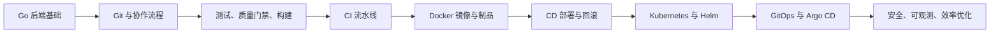

# Go 后端工程师 CI/CD 系统学习路线图

> 目标：把 CI/CD 从“会写一段 YAML”升级成“能为 Go 后端项目设计、实现、排障、优化交付流水线”的工程能力。

## 适用对象

- 正在学习或准备转向 Go 后端开发。
- 已经了解基本编程、Git、Linux 命令，但对 CI/CD 缺少系统认知。
- 希望最终能独立完成：代码提交、自动测试、构建镜像、发布制品、部署服务、回滚、告警与安全扫描。

## 总体节奏

建议周期：12 到 16 周。

建议投入：每周 8 到 12 小时。

推荐主线项目：从第 1 周开始维护一个小型 Go 后端服务，例如 `go-cicd-lab`：

- REST API：用户、文章、待办事项任选其一。
- 数据库：PostgreSQL 或 MySQL。
- 缓存：Redis，可后置。
- 健康检查：`/healthz`、`/readyz`。
- 指标：Prometheus `/metrics`，可后置。
- 部署目标：本地 Docker Compose、远程 Linux VM、本地 Kubernetes kind/minikube、云上 Kubernetes 可选。

学习 CI/CD 最忌只看配置。每个阶段都要留下一个可运行产物，让流水线真的服务于项目。

## 学习地图



## 阶段 0：建立 CI/CD 全局心智

时间：2 到 3 天。

### 你要理解什么

- CI：持续集成，核心是让每次代码变更尽快被构建、测试和检查。
- CD 可以有两层含义：
  - Continuous Delivery：持续交付，代码随时处于可发布状态，生产发布通常需要人工批准。
  - Continuous Deployment：持续部署，满足条件后自动发布到生产。
- Pipeline：由触发器、任务、阶段、依赖、环境、制品、密钥、日志组成。
- 典型链路：

```text
commit -> lint -> unit test -> integration test -> build binary
       -> build image -> scan -> push artifact/image
       -> deploy staging -> smoke test -> approve -> deploy production
       -> observe -> rollback if needed
```

### 必会概念

- Build：把源码转成二进制、镜像或包。
- Test：单元测试、集成测试、端到端测试、冒烟测试、回归测试。
- Artifact：构建产物，例如 Go 二进制、测试报告、覆盖率报告、Docker 镜像、Helm Chart。
- Runner/Agent：执行流水线任务的机器或容器。
- Environment：dev、test、staging、production。
- Secret：Token、密码、证书、云厂商凭证。
- Gate：质量门禁，例如测试通过、覆盖率达标、安全扫描无高危漏洞、人工审批。
- Rollback/Rollout：回滚和渐进发布。

### 验收标准

- 你能画出自己项目从提交代码到部署上线的流程图。
- 你能解释 CI、Continuous Delivery、Continuous Deployment 的区别。
- 你能说清楚“缓存”和“制品”的区别。

## 阶段 1：Git、分支策略与协作基础

时间：1 周。

CI/CD 的起点不是 YAML，而是协作流程。流水线要服务于团队提交代码的方式。

### 学习目标

- 熟悉 Git 日常操作和 Pull Request/Merge Request 流程。
- 理解不同分支策略对流水线设计的影响。
- 学会用 tag、release、commit message 触发不同流水线。

### 关键知识

- Git 基础：`clone`、`branch`、`checkout/switch`、`add`、`commit`、`pull`、`push`、`merge`、`rebase`、`tag`。
- Pull Request/Merge Request：代码评审、状态检查、保护分支。
- 分支策略：
  - Trunk-Based Development：推荐优先学习，主干小步提交，适合高频交付。
  - Git Flow：适合发布节奏较慢、版本分支较多的场景。
- 语义化版本：`v1.2.3`。
- Conventional Commits：例如 `feat:`、`fix:`、`chore:`。

### 实战任务

- 创建 `go-cicd-lab` 仓库。
- 设置 `main` 分支保护：必须通过 CI 才能合并。
- 设计最小协作规则：
  - 所有功能走 PR。
  - PR 必须通过测试。
  - 发布使用 Git tag，例如 `v0.1.0`。

### 验收标准

- 能用 PR 触发检查。
- 能用 tag 区分“普通提交”和“发布动作”。
- 能解释为什么生产发布不应该依赖开发者本地机器。

## 阶段 2：Go 项目的质量门禁

时间：2 周。

Go 后端工程师做 CI/CD，首先要把 Go 项目本身变成“适合自动化”的形态。

### 学习目标

- 掌握 Go 项目的构建、测试、静态检查、安全扫描。
- 为后续 CI 流水线准备本地可复现命令。
- 让本地命令和 CI 命令尽量一致。

### 关键知识

- Go Modules：`go.mod`、`go.sum`、依赖版本管理。
- 测试：
  - 单元测试：`go test ./...`
  - 表格驱动测试。
  - 集成测试：依赖数据库、Redis、外部服务。
  - Race Detector：并发场景使用 `go test -race ./...`。
  - 覆盖率：`go test -coverprofile=coverage.out ./...`。
  - Fuzzing：适合输入解析、协议处理、边界条件复杂的函数。
- 静态检查：
  - `go vet ./...`
  - `golangci-lint run`
- 安全检查：
  - `govulncheck ./...`
- 构建：
  - `go build ./...`
  - `CGO_ENABLED=0 GOOS=linux GOARCH=amd64 go build -o bin/app ./cmd/server`

### 推荐项目结构

```text
go-cicd-lab/
  cmd/server/
  internal/
    config/
    handler/
    service/
    repository/
  migrations/
  deploy/
  scripts/
  Makefile
  go.mod
  go.sum
```

### Makefile 示例目标

```makefile
.PHONY: fmt vet lint test test-race vuln build

fmt:
	go fmt ./...

vet:
	go vet ./...

lint:
	golangci-lint run

test:
	go test ./...

test-race:
	go test -race ./...

vuln:
	govulncheck ./...

build:
	CGO_ENABLED=0 GOOS=linux GOARCH=amd64 go build -o bin/server ./cmd/server
```

### 实战任务

- 为项目补齐最少 5 个单元测试。
- 为一个 HTTP handler 写集成测试。
- 接入 `golangci-lint` 配置。
- 接入 `govulncheck`。
- 添加 `Makefile`，保证本地一条命令能跑完核心检查：

```bash
make fmt vet lint test test-race vuln build
```

### 验收标准

- 任何人 clone 仓库后，可以用固定命令完成构建和测试。
- 测试失败时能快速定位日志。
- 你能解释单元测试、集成测试、冒烟测试分别解决什么问题。

## 阶段 3：第一个 CI 流水线

时间：1 到 2 周。

建议先选一个平台深入学习。个人学习推荐先用 GitHub Actions；如果你目标公司偏 GitLab，也可以平行学习 GitLab CI/CD。

### 学习目标

- 用 YAML 定义 CI 流程。
- 理解触发器、job、step、cache、artifact、matrix、secret。
- 把阶段 2 的本地命令搬到 CI 中。

### GitHub Actions 最小流水线示例

```yaml
name: ci

on:
  pull_request:
  push:
    branches: [main]

jobs:
  test:
    runs-on: ubuntu-latest
    steps:
      - uses: actions/checkout@v4
      - uses: actions/setup-go@v5
        with:
          go-version: "1.25.x"
          cache: true
      - run: go mod download
      - run: go vet ./...
      - run: go test -race -coverprofile=coverage.out ./...
      - run: go build ./...
```

### 关键知识

- 触发方式：
  - push。
  - pull request。
  - tag。
  - 手动触发。
  - 定时触发。
- Job 与 step：
  - job 之间默认隔离。
  - step 在同一个 job 环境内顺序执行。
- Cache 与 artifact：
  - cache 用于复用依赖下载、构建缓存。
  - artifact 用于传递或保存构建结果、测试报告。
- Matrix：
  - 多 Go 版本。
  - 多操作系统。
  - 多架构。
- Secret：
  - 不要打印。
  - 不要放进镜像层。
  - 最小权限。

### 实战任务

- 创建 `.github/workflows/ci.yml`。
- 在 PR 和 main push 时自动执行：
  - `go mod download`
  - `go vet ./...`
  - `golangci-lint run`
  - `go test -race -coverprofile=coverage.out ./...`
  - `go build ./...`
- 上传覆盖率报告 artifact。
- 故意制造一个失败测试，观察 CI 日志并修复。

### 验收标准

- PR 页面能看到 CI 状态。
- main 分支只允许 CI 通过后合并。
- 你能说清楚 cache key 失效会发生什么。
- 你能根据日志定位失败的 job 和 step。

## 阶段 4：Docker、镜像与制品管理

时间：2 周。

Go 服务通常会以容器镜像发布。CI/CD 的中段能力是：可重复构建、可追溯、可扫描、可发布的制品。

### 学习目标

- 为 Go 服务编写合理的 Dockerfile。
- 理解多阶段构建、镜像标签、镜像仓库、SBOM 和镜像扫描。
- 在 CI 中构建并推送镜像。

### 关键知识

- Dockerfile 多阶段构建。
- `.dockerignore`。
- 镜像标签策略：
  - `latest` 不适合作为生产唯一依据。
  - 推荐同时打：Git SHA、语义化版本、分支名或环境名。
- 镜像仓库：
  - GitHub Container Registry。
  - GitLab Container Registry。
  - Docker Hub。
  - 云厂商镜像仓库。
- 镜像安全：
  - 使用更小的运行时镜像。
  - 不把密钥写入镜像。
  - 扫描基础镜像和应用依赖。
- 制品追溯：
  - commit SHA。
  - build time。
  - version。
  - provenance。

### Go Dockerfile 示例

```dockerfile
FROM golang:1.25 AS builder

WORKDIR /src
COPY go.mod go.sum ./
RUN go mod download
COPY . .
RUN CGO_ENABLED=0 GOOS=linux GOARCH=amd64 go build -o /out/server ./cmd/server

FROM gcr.io/distroless/static-debian12:nonroot

WORKDIR /
COPY --from=builder /out/server /server
USER nonroot:nonroot
EXPOSE 8080
ENTRYPOINT ["/server"]
```

### 实战任务

- 为 `go-cicd-lab` 添加 Dockerfile。
- 本地构建镜像：

```bash
docker build -t go-cicd-lab:local .
docker run --rm -p 8080:8080 go-cicd-lab:local
```

- 在 CI 中构建镜像。
- 在 tag 推送时，把镜像推送到镜像仓库：
  - `go-cicd-lab:${{ github.sha }}`
  - `go-cicd-lab:v0.1.0`
- 添加镜像扫描工具，例如 Trivy 或平台内置扫描。

### 验收标准

- 镜像可以独立运行。
- 镜像标签可以追溯到具体 commit。
- 你能解释为什么生产部署应使用不可变标签，而不是只用 `latest`。

## 阶段 5：CD 基础：从流水线部署到环境

时间：2 周。

先从简单部署开始，不要一上来就 Kubernetes。你要先理解“部署动作”本身。

### 学习目标

- 理解部署、发布、回滚、环境隔离。
- 能把 Go 服务部署到一台 Linux VM 或 Docker Compose 环境。
- 能设计 staging 和 production 的差异。

### 关键知识

- 部署方式：
  - SSH 到服务器执行脚本。
  - Docker Compose 拉取新镜像并重启。
  - Kubernetes Deployment 更新镜像。
  - GitOps 控制器同步配置。
- 环境变量和配置管理。
- 数据库迁移：
  - 迁移脚本要可重复、可回滚或可补偿。
  - 谨慎把破坏性 schema 变更放进自动部署。
- 发布策略：
  - Rolling update。
  - Blue/Green。
  - Canary。
- 回滚策略：
  - 回滚镜像版本。
  - 回滚配置。
  - 数据库变更通常不能简单回滚，要提前设计。

### 实战任务

- 创建 `docker-compose.yml`，包含：
  - Go API。
  - PostgreSQL。
  - Redis，可选。
- 创建 `deploy.sh`：
  - 登录镜像仓库。
  - 拉取指定 tag 镜像。
  - 重启服务。
  - 执行健康检查。
- 在 GitHub Actions 中增加 `deploy-staging` job：
  - main 分支通过 CI 后部署 staging。
  - 生产环境仍使用手动审批。

### 验收标准

- 你能用一个指定镜像 tag 部署 staging。
- 部署失败时流水线失败，而不是“看似成功”。
- 你能手动回滚到上一个镜像 tag。

## 阶段 6：Kubernetes 与 Helm

时间：2 到 3 周。

Kubernetes 是很多 Go 后端服务的主流运行环境。CI/CD 到这里会从“部署一台机器”变成“声明式更新集群状态”。

### 学习目标

- 理解 Kubernetes 中服务运行的核心对象。
- 能用 Deployment、Service、ConfigMap、Secret 部署 Go 服务。
- 能用 Helm 管理多环境配置。

### Kubernetes 必会对象

- Pod：最小调度单元。
- Deployment：声明副本数和滚动更新策略。
- Service：稳定访问入口。
- Ingress：七层入口。
- ConfigMap：非敏感配置。
- Secret：敏感配置。
- Job/CronJob：一次性任务或定时任务。
- Namespace：环境或团队隔离。
- HPA：水平自动扩缩容。
- Liveness Probe：判断容器是否需要重启。
- Readiness Probe：判断容器是否可以接流量。
- Startup Probe：慢启动服务的启动保护。

### Helm 学习重点

- Chart 结构。
- `values.yaml`。
- 模板函数。
- 多环境 values：
  - `values-dev.yaml`
  - `values-staging.yaml`
  - `values-prod.yaml`
- `helm lint`。
- `helm template`。
- `helm upgrade --install`。
- `helm rollback`。

### 实战任务

- 用 kind 或 minikube 创建本地 Kubernetes 集群。
- 为项目编写 Kubernetes manifests：
  - Deployment。
  - Service。
  - ConfigMap。
  - Secret 示例。
  - Readiness/Liveness Probe。
- 把 manifests 改造成 Helm Chart。
- 在 CI 中执行：
  - `helm lint`
  - `helm template`
  - 可选：使用 kubeconform/kubeval 校验资源。
- 在 CD 中部署到本地或测试集群：

```bash
helm upgrade --install go-cicd-lab ./deploy/helm/go-cicd-lab \
  --namespace go-cicd-lab \
  --create-namespace \
  --set image.tag=v0.1.0
```

### 验收标准

- 能通过 Helm 安装、升级、回滚 Go 服务。
- 你能解释 readiness 和 liveness 的区别。
- 你能观察 `kubectl rollout status` 并处理发布失败。

## 阶段 7：GitOps 与 Argo CD

时间：1 到 2 周。

GitOps 的核心思想：Git 仓库保存期望状态，集群控制器负责把实际状态同步到期望状态。

### 学习目标

- 理解 Push-based CD 和 Pull-based GitOps 的区别。
- 会用 Argo CD 部署 Helm/Kustomize 应用。
- 会处理 OutOfSync、Sync、Rollback。

### 关键知识

- 应用代码仓库与部署配置仓库是否分离。
- 镜像构建完成后，流水线更新部署仓库中的 image tag。
- Argo CD 监听部署仓库并同步到集群。
- 手动同步与自动同步。
- Drift Detection：集群实际状态偏离 Git 中期望状态。

### 推荐仓库结构

```text
go-cicd-lab/
  app source code
  Dockerfile
  .github/workflows/

go-cicd-lab-deploy/
  environments/
    staging/
      values.yaml
    production/
      values.yaml
  charts/
```

### 实战任务

- 在本地 kind/minikube 安装 Argo CD。
- 创建一个 Argo CD Application 指向部署仓库。
- 修改 image tag，观察 Argo CD 同步。
- 尝试手动改集群资源，观察 OutOfSync。
- 设计生产发布审批：
  - CI 自动更新 staging。
  - production 通过 PR 修改 tag。
  - PR 合并后 Argo CD 同步。

### 验收标准

- 你能说清楚“谁有集群部署权限”。
- 你能通过 Git commit 找到某次生产发布。
- 你能处理一次失败同步并回滚到上一版本。

## 阶段 8：CI/CD 安全

时间：1 到 2 周。

CI/CD 系统拥有源码、密钥、制品仓库、云环境的访问权。它本身就是高价值攻击面。

### 学习目标

- 为流水线建立基本安全边界。
- 学会依赖扫描、镜像扫描、密钥管理、最小权限。
- 了解软件供应链安全。

### 关键知识

- Secret 管理：
  - 使用平台 Secret Store。
  - 不在日志中打印。
  - 不写入 Docker 镜像。
  - 定期轮换。
- 权限最小化：
  - GitHub Actions `permissions` 显式声明。
  - 部署凭证只允许部署目标环境。
  - PR 来自 fork 时谨慎使用 secret。
- 依赖安全：
  - `govulncheck`。
  - Dependabot/Renovate。
  - 依赖锁定和定期升级。
- 镜像安全：
  - 扫描 CVE。
  - 使用较小基础镜像。
  - 以非 root 用户运行。
- 供应链安全：
  - SBOM。
  - 签名。
  - Provenance。
  - SLSA 基础概念。

### 实战任务

- 在 CI 中加入 `govulncheck`。
- 在镜像构建后进行镜像扫描。
- 给 GitHub Actions 增加最小权限声明：

```yaml
permissions:
  contents: read
  packages: write
```

- 尝试生成 SBOM，例如使用 Syft。
- 可选：使用 Cosign 对镜像签名。

### 验收标准

- 你能列出流水线中有哪些密钥。
- 你能解释 PR 流水线为什么不能随便拿生产密钥。
- 你能根据漏洞扫描结果判断是否阻断发布。

## 阶段 9：可观测、效率与工程化优化

时间：1 到 2 周。

真正工作的 CI/CD 不只是“能跑”，还要快、稳、可观察、可维护。

### 学习目标

- 能定位流水线慢在哪里。
- 能设计有效缓存。
- 能给发布过程补齐可观测信号。
- 能用指标衡量交付效率。

### 关键知识

- 流水线优化：
  - 并行 job。
  - 依赖缓存。
  - Docker layer cache。
  - 只在必要路径变更时触发。
  - 长耗时测试分层。
- 可观测：
  - 部署事件。
  - 应用日志。
  - Prometheus metrics。
  - Grafana dashboard。
  - 告警。
- 发布后验证：
  - Smoke test。
  - Synthetic check。
  - Error rate。
  - Latency。
  - Saturation。
- DORA 指标：
  - Deployment Frequency：部署频率。
  - Lead Time for Changes：变更前置时间。
  - Change Failure Rate：变更失败率。
  - MTTR：平均恢复时间。

### 实战任务

- 统计 CI 每个 job 的耗时，找出最慢步骤。
- 给 Go 服务接入 Prometheus 指标。
- 发布后自动调用 `/healthz` 和核心 API。
- 在 README 中记录：
  - 如何发布。
  - 如何回滚。
  - 如何排查失败流水线。

### 验收标准

- 流水线失败时，你能判断是代码问题、环境问题、凭证问题还是平台问题。
- 发布后能看到版本号、commit SHA、启动时间、健康状态。
- 你能给团队提出一项有效的 CI/CD 加速方案。

## 贯穿全程的毕业项目

项目名：`go-cicd-lab`。

### 功能要求

- Go HTTP API。
- PostgreSQL 持久化。
- 至少 3 个业务接口。
- `/healthz`：进程健康。
- `/readyz`：依赖健康，例如数据库连接。
- `/metrics`：Prometheus 指标，可选但推荐。
- 结构化日志。
- 配置通过环境变量注入。

### CI 要求

- PR 触发：
  - format 检查。
  - `go vet`。
  - `golangci-lint`。
  - 单元测试。
  - 集成测试。
  - race test。
  - 覆盖率报告。
- main 分支触发：
  - 构建二进制。
  - 构建 Docker 镜像。
  - 镜像扫描。
  - 推送镜像。
- tag 触发：
  - 生成 release。
  - 发布版本镜像。

### CD 要求

- staging：
  - main 分支自动部署。
  - 部署后自动冒烟测试。
- production：
  - tag 或部署仓库 PR 触发。
  - 需要人工审批。
  - 支持回滚。

### Kubernetes 要求

- Helm Chart。
- ConfigMap/Secret。
- readiness/liveness/startup probe。
- 资源 requests/limits。
- 滚动更新策略。
- HPA 可选。

### 安全要求

- `govulncheck`。
- 镜像漏洞扫描。
- secret 不进仓库。
- 流水线最小权限。
- 镜像非 root 运行。
- 版本可追溯到 commit SHA。

## 每周学习安排

| 周次 | 主题 | 产出 |
| --- | --- | --- |
| 第 1 周 | CI/CD 概念、Git 协作、分支策略 | 仓库、PR 流程、分支保护 |
| 第 2 周 | Go 测试、构建、Makefile | 本地质量命令 |
| 第 3 周 | lint、race、coverage、govulncheck | 完整 Go 质量门禁 |
| 第 4 周 | GitHub Actions/GitLab CI 入门 | 第一个 PR CI |
| 第 5 周 | cache、artifact、matrix、secret | 更完整的 CI 流水线 |
| 第 6 周 | Docker 与多阶段构建 | 可运行镜像 |
| 第 7 周 | 镜像仓库、tag、release、扫描 | 镜像发布流水线 |
| 第 8 周 | Docker Compose/VM 部署 | staging 自动部署 |
| 第 9 周 | Kubernetes 核心对象 | K8s manifests |
| 第 10 周 | Helm | Helm Chart 和多环境配置 |
| 第 11 周 | Argo CD/GitOps | GitOps 部署链路 |
| 第 12 周 | 回滚、审批、生产发布策略 | 可控 production 发布 |
| 第 13 周 | 安全、SBOM、签名、SLSA | 安全增强流水线 |
| 第 14 周 | 可观测、冒烟测试、DORA | 发布后验证和指标 |
| 第 15 周 | 性能优化、缓存优化 | 更快的 pipeline |
| 第 16 周 | 总复盘、文档和面试准备 | 毕业项目 README 和演示 |

如果你时间紧，可以把第 13 到 16 周压缩为“进阶补强”；如果你想找中高级岗位，安全、GitOps、可观测不要跳过。

## Go 后端 CI/CD 面试检查清单

### 基础问题

- CI 和 CD 有什么区别？
- 为什么要做分支保护？
- cache 和 artifact 有什么区别？
- 为什么生产部署不建议只用 `latest` 镜像标签？
- 如何在 CI 中管理 secret？

### Go 项目问题

- `go test ./...`、`go test -race ./...`、`go vet ./...` 分别解决什么问题？
- 集成测试依赖数据库时，你会如何在 CI 中准备测试环境？
- 如何做 Go 服务的多阶段 Docker 构建？
- 如何把版本号和 commit SHA 注入 Go 二进制？
- `govulncheck` 的价值是什么？

### 部署问题

- staging 和 production 的流水线应该有什么区别？
- 如何设计回滚？
- 数据库迁移失败怎么办？
- readiness probe 和 liveness probe 的区别是什么？
- Kubernetes 滚动更新失败时如何排查？

### 进阶问题

- GitOps 和传统 push-based CD 有什么区别？
- 为什么 CI/CD 平台是供应链安全的一部分？
- 如何减少流水线耗时？
- 如何评估一次发布是否成功？
- 如何防止未授权代码拿到生产凭证？

## 推荐学习资料

优先看官方文档。工具会变，但核心模型稳定。

### CI/CD 平台

- GitHub Actions 文档：<https://docs.github.com/actions>
- GitHub Actions 构建和测试 Go：<https://docs.github.com/actions/automating-builds-and-tests/building-and-testing-go>
- GitHub Actions 工作流语法：<https://docs.github.com/actions/using-workflows/workflow-syntax-for-github-actions>
- GitLab CI/CD 快速开始：<https://docs.gitlab.com/ci/quick_start/>
- GitLab CI/CD YAML 参考：<https://docs.gitlab.com/ci/yaml/>

### Go 质量与安全

- Go 官方文档：<https://go.dev/doc/>
- Go Race Detector：<https://go.dev/doc/articles/race_detector>
- Go Fuzzing 入门：<https://go.dev/doc/tutorial/fuzz>
- Go Vulnerability Management：<https://go.dev/doc/security/vuln/>
- golangci-lint：<https://golangci-lint.run/>

### Docker 与镜像

- Docker Go 指南：<https://docs.docker.com/guides/golang/>
- Docker 多阶段构建：<https://docs.docker.com/build/building/multi-stage/>
- Docker 构建最佳实践：<https://docs.docker.com/build/building/best-practices/>

### Kubernetes 与部署

- Kubernetes Deployment：<https://kubernetes.io/docs/concepts/workloads/controllers/deployment/>
- Kubernetes Rolling Update：<https://kubernetes.io/docs/tutorials/kubernetes-basics/update/update-intro/>
- Kubernetes Probes：<https://kubernetes.io/docs/tasks/configure-pod-container/configure-liveness-readiness-startup-probes/>
- Helm 文档：<https://helm.sh/docs/>
- Helm Chart 文档：<https://helm.sh/docs/topics/charts/>
- Argo CD 文档：<https://argo-cd.readthedocs.io/>

### IaC 与供应链安全

- Terraform 文档：<https://developer.hashicorp.com/terraform>
- Terraform 自动化：<https://developer.hashicorp.com/terraform/tutorials/automation>
- SLSA：<https://slsa.dev/>

## 学习方法建议

- 先把一个平台学透，再横向扩展。推荐顺序：GitHub Actions -> GitLab CI/CD。
- 每学一个概念，都要落到 `go-cicd-lab` 项目里。
- 本地命令和 CI 命令保持一致，减少“本地能跑，CI 不能跑”的问题。
- 流水线失败日志要认真看，排障能力比背配置更重要。
- 每个阶段都写 README：怎么运行、怎么测试、怎么发布、怎么回滚。
- 不要一开始追求复杂架构。先做一条可靠的简单流水线，再逐步加入安全、审批、GitOps、可观测。

## 最终能力画像

学完这条路线后，你应该能做到：

- 为 Go 后端项目设计完整 CI 流水线。
- 把测试、lint、安全扫描、构建、镜像发布自动化。
- 设计 staging/production 的部署流程和审批机制。
- 使用 Docker、Kubernetes、Helm 部署 Go 服务。
- 使用 Argo CD 理解并实践 GitOps。
- 能定位常见流水线失败原因。
- 能解释 CI/CD 中的安全风险和防护方式。
- 能用发布频率、变更前置时间、失败率、恢复时间衡量交付质量。

到这里，你就不只是“会配 CI/CD”，而是具备了后端工程师在真实团队里持续交付服务的能力。
