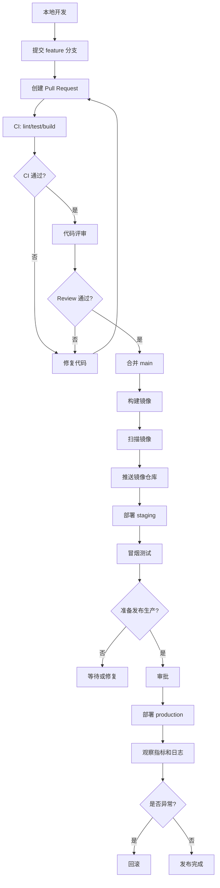

# 03：从一次提交到生产环境

## 1. 本节目标

这一节我们把 CI/CD 放进一个真实 Go 后端服务场景里。

假设你正在开发一个待办事项 API：

- `POST /todos` 创建待办事项。
- `GET /todos` 查询待办事项。
- `PATCH /todos/{id}` 更新状态。
- 服务使用 PostgreSQL。
- 服务最终通过 Docker 镜像部署。

现在你完成了一个新功能：给待办事项增加优先级字段。

我们来看这次变更如何从代码提交走到生产环境。

## 2. 第一步：本地开发

你在本地修改代码：

```text
internal/handler/todo.go
internal/service/todo.go
internal/repository/todo.go
migrations/003_add_priority_to_todos.sql
```

在提交前，你应该先本地运行：

```bash
go fmt ./...
go vet ./...
go test ./...
go build ./...
```

本地检查不是 CI 的替代品，但能减少低级错误。

## 3. 第二步：提交代码

你提交代码：

```bash
git checkout -b feat/todo-priority
git add .
git commit -m "feat: add todo priority"
git push origin feat/todo-priority
```

这一步通常不会直接发布任何环境。它只是把你的变更送到远程仓库。

## 4. 第三步：创建 Pull Request

你创建 PR，请求把 `feat/todo-priority` 合并到 `main`。

PR 会触发 CI：

```text
pull request opened
-> checkout code
-> setup Go
-> download dependencies
-> lint
-> unit test
-> integration test
-> build
-> upload report
```

CI 在这里要回答：

```text
这次变更是否具备合并资格？
```

如果测试失败，PR 不能合并。

## 5. 第四步：代码评审

代码评审关注 CI 不容易发现的问题：

- 业务逻辑是否正确。
- 接口设计是否合理。
- 错误处理是否完整。
- 数据库迁移是否安全。
- 是否破坏向后兼容。
- 是否可能引入性能问题。
- 是否有安全风险。

CI 和代码评审是互补关系。

```text
CI 更擅长发现确定性问题。
Review 更擅长发现设计和上下文问题。
```

## 6. 第五步：合并到 main

PR 通过 CI 和 Review 后合并到 `main`。

这时可以触发更完整的流水线：

```text
push main
-> run CI again
-> build Linux binary
-> build Docker image
-> scan image
-> push image to registry
-> deploy staging
-> run smoke test
```

为什么合并后还要再跑一次？

因为 PR 检查的是分支上的代码，合并后主分支可能已经有其他变化。main 分支必须始终代表可靠状态。

## 7. 第六步：构建制品

Go 后端常见制品有两类：

```text
Go binary
Docker image
```

二进制示例：

```text
bin/server
```

镜像示例：

```text
registry.example.com/go-cicd-lab:8f3a2c1
registry.example.com/go-cicd-lab:v0.3.0
```

生产环境不要只依赖 `latest`，因为它不够明确。

好的制品应该能回答：

- 它来自哪个 commit？
- 它由哪次流水线构建？
- 它使用了哪些依赖？
- 它被部署到了哪个环境？

## 8. 第七步：部署 staging

staging 是预发布环境，应该尽量接近 production。

部署 staging 的价值：

- 验证服务能否启动。
- 验证数据库迁移。
- 验证配置是否正确。
- 验证依赖服务是否可访问。
- 验证核心接口是否正常。

部署后应该自动做冒烟测试：

```bash
curl -f https://staging.example.com/healthz
curl -f https://staging.example.com/readyz
```

更完整一点还可以调用一个核心业务接口。

## 9. 第八步：生产发布审批

如果团队采用持续交付，生产发布前通常需要审批。

审批时应查看：

- 这次发布包含哪些 commit。
- CI 是否全部通过。
- staging 是否验证通过。
- 是否有数据库迁移。
- 是否有回滚方案。
- 是否在合适的发布时间窗口。

审批不是走形式，而是一次发布风险确认。

## 10. 第九步：部署 production

生产部署常见策略：

- Rolling Update：逐步替换旧实例。
- Blue/Green：准备一套新环境，切换流量。
- Canary：先给少量用户，再逐步扩大。

初学阶段先理解 Rolling Update 即可。

部署生产时，流水线需要记录：

```text
version: v0.3.0
commit: 8f3a2c1
image: registry.example.com/go-cicd-lab:8f3a2c1
environment: production
deployed_at: 2026-07-04T10:00:00+08:00
deployed_by: ci-bot
```

这些信息是回滚和审计的基础。

## 11. 第十步：发布后观察

上线后不要立刻离开。

你要观察：

- 服务是否健康。
- 错误率是否升高。
- 延迟是否升高。
- CPU、内存是否异常。
- 日志是否出现大量错误。
- 核心业务指标是否异常。

典型发布后检查：

```text
health check
-> smoke test
-> logs
-> metrics
-> alerts
```

## 12. 第十一步：回滚

如果发布失败，应该能快速回滚。

最简单的回滚方式：

```text
把生产服务使用的镜像 tag 改回上一个稳定版本
```

但数据库变更要小心。

例如：

- 新增字段通常容易回滚。
- 删除字段很危险。
- 修改字段类型可能影响旧版本。
- 数据迁移失败可能需要人工修复。

所以生产变更要尽量遵循：

```text
先兼容，再切换，最后清理
```

## 13. 完整链路图



## 14. 小练习

请为下面这个需求写一条从提交到上线的流程：

```text
给用户服务新增“修改邮箱”接口。
```

至少写出：

1. PR 阶段需要跑哪些检查。
2. main 合并后要构建什么制品。
3. staging 要验证什么。
4. production 发布前要检查什么。
5. 失败后怎么回滚。

## 15. 本节小结

你现在应该理解：

- CI/CD 是围绕一次代码变更展开的。
- PR 阶段重点是证明代码能合并。
- main 阶段重点是生成可部署制品。
- staging 阶段重点是验证部署和核心功能。
- production 阶段重点是可控发布和可观测。
- 回滚能力必须在发布前设计好。

