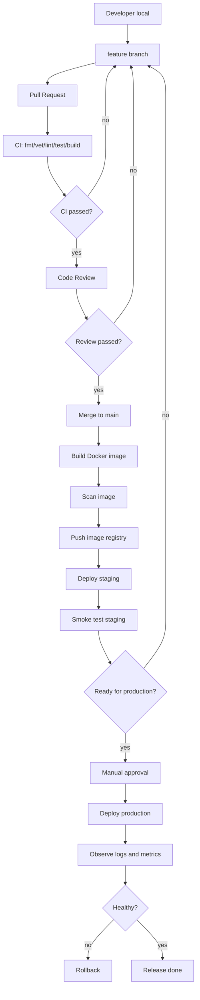

# 05：动手练习，画出你的第一条流水线

## 1. 本节目标

这一节不要求你真的写 CI 配置。

你要做的是：为一个 Go 后端服务画出第一版 CI/CD 流程，并解释每一步为什么存在。

这会帮助你后面学习 GitHub Actions、GitLab CI、Docker、Kubernetes 时不迷路。

## 2. 练习项目设定

假设你要做一个 Go 后端项目：

```text
项目名：go-cicd-lab
功能：待办事项 API
语言：Go
数据库：PostgreSQL
部署方式：Docker
环境：staging 和 production
```

接口：

```text
GET /healthz
GET /readyz
POST /todos
GET /todos
PATCH /todos/{id}
```

## 3. 第一步：写出代码流转路线

先写最粗粒度路线：

```text
本地开发
-> 提交 feature 分支
-> 创建 PR
-> CI 检查
-> Review
-> 合并 main
-> 构建镜像
-> 部署 staging
-> staging 验证
-> 审批
-> 部署 production
-> 观察
-> 必要时回滚
```

这是你的第一版地图。

## 4. 第二步：给 PR 阶段设计检查

PR 阶段的问题是：

```text
这段代码能不能合并？
```

建议检查：

```text
checkout code
-> setup Go
-> go mod download
-> go fmt check
-> go vet ./...
-> golangci-lint run
-> go test ./...
-> go test -race ./...
-> go build ./...
```

初学阶段可以先不追求所有工具都接入，但流程要知道。

## 5. 第三步：给 main 阶段设计构建

main 阶段的问题是：

```text
这次合并能不能生成可部署制品？
```

建议流程：

```text
push main
-> run tests
-> build binary
-> build Docker image
-> scan image
-> push image
```

镜像标签可以设计成：

```text
go-cicd-lab:<git-sha>
go-cicd-lab:main-<git-sha>
```

例如：

```text
go-cicd-lab:8f3a2c1
go-cicd-lab:main-8f3a2c1
```

## 6. 第四步：给 staging 阶段设计部署

staging 阶段的问题是：

```text
这个制品能不能在接近生产的环境里正常运行？
```

建议流程：

```text
deploy staging
-> wait service ready
-> check /healthz
-> check /readyz
-> run smoke test
-> record deployed version
```

冒烟测试可以先从最简单的健康检查开始：

```bash
curl -f https://staging.example.com/healthz
curl -f https://staging.example.com/readyz
```

`-f` 的意思是 HTTP 状态码不是 2xx/3xx 时让 curl 返回失败。

## 7. 第五步：给 production 阶段设计门禁

production 阶段的问题是：

```text
这次发布是否足够安全、可控、可回滚？
```

建议门禁：

```text
staging deploy success
staging smoke test success
image scan passed
manual approval
rollback version known
```

生产发布建议使用版本 tag：

```bash
git tag v0.1.0
git push origin v0.1.0
```

tag 可以触发正式发布流程。

## 8. 第六步：设计回滚

不要等事故发生时再想回滚。

你需要提前写清楚：

```text
当前生产版本是什么？
上一个稳定版本是什么？
如何把服务切回上一个版本？
数据库变更是否兼容旧版本？
回滚后如何验证？
```

第一版回滚流程可以写成：

```text
选择上一个稳定镜像 tag
-> 部署该镜像到 production
-> 等待服务 ready
-> 检查 /healthz
-> 检查 /readyz
-> 调用核心接口
-> 观察错误率和日志
```

## 9. 第七步：画出完整流程图

你可以复制下面这张图到自己的笔记里，再根据项目调整。



## 10. 第八步：写出你的第一版流水线说明

请创建一个自己的学习笔记，写出下面内容：

```markdown
# go-cicd-lab 第一版 CI/CD 设计

## 触发规则

- PR：运行 CI 检查。
- push main：构建并部署 staging。
- tag v*：发布 production。

## PR 检查

- fmt
- vet
- lint
- unit test
- race test
- build

## 制品

- Docker image
- 测试报告
- 覆盖率报告

## 环境

- staging：自动部署。
- production：人工审批后部署。

## 密钥

- 镜像仓库 token。
- staging 部署凭证。
- production 部署凭证。

## 回滚

- 使用上一个稳定镜像 tag。
- 回滚后检查 healthz、readyz、核心接口。
```

## 11. 自查问题

完成后问自己：

- 每个步骤是不是都有明确目的？
- 哪些步骤失败时应该阻止合并？
- 哪些步骤失败时应该阻止生产发布？
- 哪些信息需要保存用于回滚？
- 哪些 secret 只应该给 production 部署使用？

## 12. 本节小结

到这里，你已经完成了第 0 阶段最重要的练习：画出一条完整的 Go 后端 CI/CD 流水线。

后面学习具体工具时，你只是在把这张图逐步变成真实配置。

