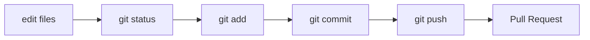

# 01：Git 核心心智模型

## 1. 为什么 CI/CD 要从 Git 开始

CI/CD 的起点不是流水线配置，而是一次代码变更。

代码变更通常从这里开始：

```text
开发者本地修改代码
-> 提交 commit
-> 推送到远程仓库
-> 创建 PR/MR
-> 触发 CI
-> 合并主分支
-> 触发后续交付流程
```

如果 Git 协作流程混乱，CI/CD 会变得很难设计。比如：

- 不知道哪个分支代表稳定状态。
- 不知道什么提交应该触发部署。
- 不知道哪个版本已经发布到生产。
- 不知道生产事故应该回滚到哪个 commit。

所以，第 1 阶段先把 Git 和协作流程打牢。

## 2. Git 的四个区域

你可以把 Git 理解成四个区域：

```text
工作区 -> 暂存区 -> 本地仓库 -> 远程仓库
```

### 工作区

工作区就是你正在编辑的文件。

例如你修改了：

```text
main.go
internal/handler/todo.go
README.md
```

这些修改首先存在于工作区。

查看工作区状态：

```bash
git status
```

### 暂存区

暂存区表示“我准备把哪些修改放进下一次 commit”。

把文件加入暂存区：

```bash
git add main.go
git add internal/handler/todo.go
```

加入全部修改：

```bash
git add .
```

初学时不要机械地一直 `git add .`。更好的习惯是先看状态：

```bash
git status
```

再决定要提交哪些文件。

### 本地仓库

本地仓库保存你的 commit 历史。

创建 commit：

```bash
git commit -m "feat: add todo priority"
```

查看提交历史：

```bash
git log --oneline
```

### 远程仓库

远程仓库通常是 GitHub、GitLab、Gitea 或公司内部 Git 服务。

推送本地分支到远程：

```bash
git push origin feat/todo-priority
```

从远程拉取更新：

```bash
git pull
```

更准确一点，`git pull` 等于：

```text
git fetch + git merge
```

## 3. 一个 commit 是什么

commit 是 Git 里的一个快照。

它包含：

- 本次提交的文件变化。
- 作者。
- 时间。
- commit message。
- 父提交。
- commit hash。

commit hash 示例：

```text
8f3a2c1b7e...
```

在 CI/CD 中，commit hash 非常重要。它可以用来：

- 标记 Docker 镜像。
- 定位某次构建。
- 追踪某次发布。
- 回滚到指定版本。

## 4. 分支是什么

分支可以理解为指向某个 commit 的指针。

常见分支：

```text
main
feat/todo-priority
fix/login-timeout
release/v1.2.0
```

创建并切换分支：

```bash
git switch -c feat/todo-priority
```

查看当前分支：

```bash
git branch
```

切回 main：

```bash
git switch main
```

## 5. main 分支的意义

在现代 CI/CD 中，`main` 通常代表主干分支。

推荐约定：

```text
main 永远保持可构建、可测试、可部署。
```

这件事非常关键。因为很多流水线会基于 main 做事情：

```text
push main -> build image -> deploy staging
```

如果 main 经常是坏的，后面的自动化都会不可靠。

## 6. 远程分支是什么

远程分支是本地 Git 对远程仓库状态的记录。

常见名字：

```text
origin/main
origin/feat/todo-priority
```

获取远程最新状态：

```bash
git fetch origin
```

查看所有分支：

```bash
git branch -a
```

## 7. HEAD 是什么

`HEAD` 表示你当前所在的位置。

通常它指向当前分支的最新 commit。

查看：

```bash
git log --oneline --decorate -5
```

当你切换分支时，`HEAD` 也会移动。

## 8. 基础命令流程图



## 9. 小练习

在一个空目录中练习：

```bash
mkdir go-cicd-lab
cd go-cicd-lab
git init
echo "# go-cicd-lab" > README.md
git status
git add README.md
git commit -m "docs: add project readme"
git log --oneline
```

如果 Git 提示你还没有配置用户名和邮箱，执行：

```bash
git config --global user.name "Your Name"
git config --global user.email "you@example.com"
```

## 10. 本节小结

你现在应该理解：

- 工作区是正在修改的文件。
- 暂存区是下一次 commit 的候选内容。
- 本地仓库保存 commit。
- 远程仓库用于团队协作。
- commit hash 是 CI/CD 追踪版本的关键。
- main 分支通常代表主干和稳定状态。

