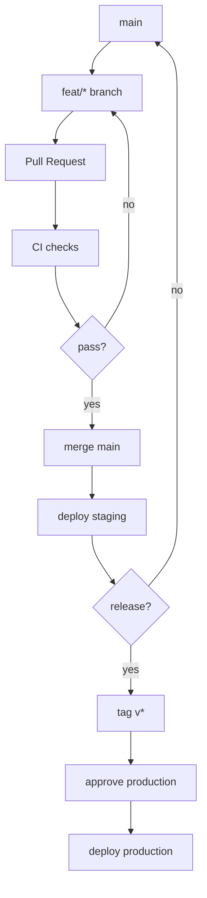

# 03：分支策略

## 1. 为什么需要分支策略

分支策略决定团队如何组织代码变化。

它会影响：

- CI 在什么时候运行。
- 哪个分支可以部署。
- 生产发布从哪里来。
- hotfix 怎么处理。
- 回滚怎么定位。

如果没有规则，团队很容易变成：

```text
每个人随便建分支
有人直接推 main
有人从旧分支发布生产
没人知道哪个版本在线上
```

CI/CD 最怕这种混乱。

## 2. 好分支策略的标准

好的分支策略应该满足：

- 简单，团队成员容易记住。
- main 分支长期保持健康。
- 每个变更都经过 PR/MR。
- 发布版本可追溯。
- hotfix 有明确路径。
- 与 CI/CD 触发规则匹配。

## 3. Trunk-Based Development

Trunk-Based Development 可以理解为主干开发。

核心思想：

```text
main 是主干。
开发者从 main 拉短生命周期分支。
小步提交，通过 PR 快速合并回 main。
```

典型流程：

```text
main
 -> feat/a
 -> PR
 -> CI
 -> merge main
 -> deploy staging
```

特点：

- 分支生命周期短。
- 合并频繁。
- 冲突较少。
- 适合持续交付和持续部署。
- 要求测试和代码评审比较及时。

推荐给大多数 Go 后端学习项目和互联网服务。

## 4. Trunk-Based 的推荐规则

```text
main 分支受保护。
所有变更通过 PR。
feature 分支尽量 1 到 2 天内合并。
PR 必须通过 CI。
main 合并后自动部署 staging。
正式发布使用 tag。
```

分支示例：

```text
feat/todo-priority
fix/login-timeout
ci/add-pr-checks
docs/update-deploy-guide
```

## 5. Git Flow

Git Flow 是一种更重的分支模型。

常见分支：

```text
main
develop
feature/*
release/*
hotfix/*
```

典型路径：

```text
feature -> develop -> release -> main
hotfix -> main -> develop
```

适合：

- 发布周期较长。
- 需要维护多个版本。
- 桌面软件、SDK、嵌入式系统。
- 企业软件有复杂版本线。

不适合初学者一开始就引入，因为分支多，规则重，CI/CD 配置也更复杂。

## 6. 环境分支

有些团队使用环境分支：

```text
dev
staging
production
```

例如：

```text
merge dev -> deploy dev
merge staging -> deploy staging
merge production -> deploy production
```

这种方式直观，但也有风险：

- 环境分支容易长期分叉。
- production 分支不一定等于 main。
- 回滚和 cherry-pick 容易混乱。
- 代码和部署配置容易混在一起。

初学建议：先不要依赖环境分支做发布。可以用 main + tag + 部署配置来表达发布。

## 7. Release Branch

Release branch 是发布候选分支。

示例：

```bash
git switch -c release/v1.2.0
```

适合场景：

- 需要冻结某个版本。
- 只允许修复 bug，不再加新功能。
- main 继续开发下一个版本。

简单 Go Web 服务通常不需要一开始使用 release branch。等你有多个客户版本或复杂发布节奏时再引入。

## 8. Hotfix Branch

Hotfix 是生产紧急修复。

推荐流程：

```text
从当前生产版本或 main 创建 hotfix 分支
-> 修复问题
-> PR + CI
-> 合并 main
-> 打 tag
-> 发布 production
```

分支示例：

```bash
git switch -c fix/login-timeout
```

如果线上版本不是 main 最新状态，就要特别小心：你需要知道当前生产运行的是哪个 tag 或 commit。

## 9. 推荐给 go-cicd-lab 的策略

对于你的学习项目，推荐：

```text
策略：Trunk-Based Development
主干：main
开发：feat/*、fix/*、docs/*、ci/*
合并：全部通过 PR
发布：tag v*
staging：main 自动部署
production：tag 触发，人工审批
```

对应 CI/CD 触发：

| Git 事件 | CI/CD 动作 |
| --- | --- |
| PR opened/synchronized | lint、test、build |
| push main | 构建镜像、部署 staging |
| push tag `v*` | 创建 release、发布 production |
| manual | 回滚或重跑部署 |

## 10. Mermaid 流程图



## 11. 小练习

请为你的项目写出：

1. 主干分支叫什么？
2. 功能分支如何命名？
3. bug 修复分支如何命名？
4. 哪些分支禁止直接 push？
5. 哪个 Git 事件触发 staging？
6. 哪个 Git 事件触发 production？
7. hotfix 应该怎么走？

## 12. 本节小结

你现在应该理解：

- 分支策略会直接影响 CI/CD 设计。
- Go 后端学习项目优先使用简单主干开发。
- main 应该保持可构建、可测试、可部署。
- tag 比环境分支更适合表达正式发布版本。

