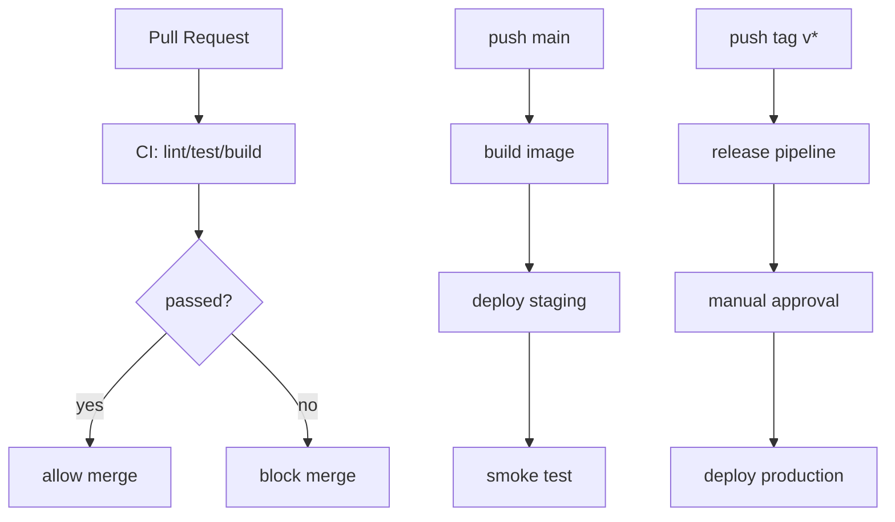

# 06：仓库规则与 CI/CD 触发

## 1. 本节目标

这一节把 Git 协作和 CI/CD 连接起来。

你要理解：

```text
什么 Git 事件触发什么流水线？
什么仓库规则阻止不安全变更进入主干？
```

## 2. 分支保护

分支保护用于防止重要分支被随意修改。

通常保护：

```text
main
release/*
production
```

学习项目至少保护 `main`。

常见规则：

- 禁止直接 push。
- 必须通过 PR。
- 必须通过 required checks。
- 必须至少 1 人 review。
- 禁止 force push。
- 禁止删除分支。

## 3. Required Checks

Required checks 是必须通过的 CI 检查。

例如：

```text
lint
test
build
```

只有这些检查通过，PR 才能合并。

这能保证：

```text
main 不会被明显失败的代码破坏。
```

## 4. CODEOWNERS

`CODEOWNERS` 可以指定某些文件由谁负责评审。

示例：

```text
# 全局默认 owner
* @your-name

# CI/CD 配置必须由平台相关人员 review
.github/workflows/* @your-name
deploy/* @your-name

# 数据库迁移需要后端 owner review
migrations/* @your-name
```

放置路径通常是：

```text
.github/CODEOWNERS
```

或：

```text
CODEOWNERS
```

具体取决于平台规则。

## 5. 不同 Git 事件适合触发什么

### Pull Request

适合做：

```text
lint
unit test
integration test
build check
security check
```

不适合直接做：

```text
部署 production
使用生产 secret
执行破坏性数据库操作
```

### Push main

适合做：

```text
完整 CI
构建镜像
推送镜像
部署 staging
冒烟测试
```

### Push tag

适合做：

```text
构建正式版本
创建 release
部署 production
生成 changelog
```

### Manual

适合做：

```text
手动部署
回滚
补跑失败流水线
重新发布某个版本
```

### Schedule

适合做：

```text
定期依赖扫描
定期镜像扫描
定期测试长期任务
```

## 6. 推荐触发表

| Git 事件 | 触发流水线 | 是否使用 secret | 是否部署 |
| --- | --- | --- | --- |
| PR | lint/test/build | 尽量不用敏感 secret | 不部署生产 |
| push main | build image/deploy staging | staging secret | 部署 staging |
| tag `v*` | release/deploy production | production secret | 审批后部署生产 |
| manual | rollback/redeploy | 按环境控制 | 可部署 |
| schedule | security scan | 最小权限 | 通常不部署 |

## 7. PR from fork 的安全风险

开源项目或多人协作时，外部贡献者可以从 fork 提 PR。

风险是：

```text
PR 中的代码可能尝试读取流水线 secret。
```

所以很多平台默认不会把敏感 secret 暴露给 fork PR。

基本原则：

- PR 检查尽量不依赖生产 secret。
- 生产部署只在受信任分支或 tag 上触发。
- 不要在 PR 流水线里打印环境变量。
- 对外部 PR 保持更严格权限。

## 8. 最小权限

CI/CD 权限应该按 job 区分。

错误做法：

```text
所有 job 都拿生产部署凭证。
```

更好的做法：

```text
PR job: 只读代码。
staging deploy job: 只能部署 staging。
production deploy job: 只能部署 production，且需要审批。
```

## 9. 仓库规则示例

给 `go-cicd-lab` 设计：

```text
main:
  - 禁止直接 push
  - PR 才能合并
  - 必须通过 ci
  - 至少 1 个 approval
  - 禁止 force push

tag v*:
  - 触发 release pipeline
  - production 部署需要审批

secret:
  - staging 和 production 分开
  - PR 不使用 production secret
```

## 10. CI/CD 触发图



## 11. 小练习

请写出你的仓库规则：

```markdown
# go-cicd-lab 仓库规则

## main 分支

- 

## PR 规则

- 

## Required checks

- 

## tag 规则

- 

## Secret 规则

- 
```

## 12. 本节小结

你现在应该理解：

- 分支保护是 CI/CD 的重要门禁。
- PR、push main、tag、manual、schedule 适合触发不同动作。
- production secret 不能随便暴露给 PR。
- 仓库权限和流水线权限应该最小化。

