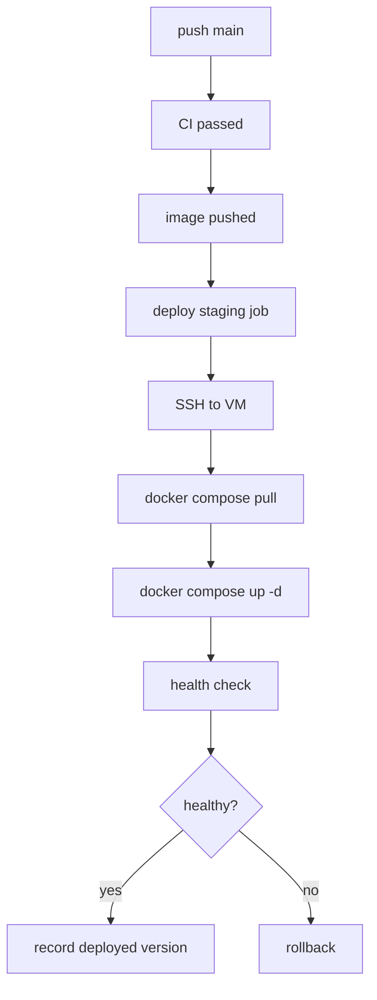

# 01：CD 模型与部署流程

## 1. 本节目标

第 3 阶段让代码通过 CI。

第 4 阶段把代码构建成镜像。

第 5 阶段要做的是：

```text
把某个明确镜像部署到某个明确环境，并验证它是否正常。
```

## 2. CD 的职责

CD 关注：

- 要部署哪个版本。
- 部署到哪个环境。
- 使用哪些配置和密钥。
- 如何执行部署。
- 如何判断部署成功。
- 失败后如何回滚。
- 如何记录部署历史。

CD 不应该是：

```text
手动 SSH 到服务器随便改文件。
```

也不应该是：

```text
不知道版本、不知道操作者、不知道回滚点的脚本。
```

## 3. 本阶段的部署方式

为了入门清晰，本阶段使用：

```text
GitHub Actions -> SSH -> Linux VM -> Docker Compose
```

流程：

```text
main/tag
-> image already built
-> deploy workflow
-> SSH to VM
-> docker compose pull
-> docker compose up -d
-> health check
-> smoke test
-> record version
```

这不是唯一方式，但非常适合学习 CD 基础。

## 4. 为什么先学单台 VM

Kubernetes 很强，但一开始会引入很多额外概念：

- Deployment。
- Service。
- Ingress。
- ConfigMap。
- Secret。
- Helm。
- Controller。

第 5 阶段先用单台 VM，是为了让你看清楚部署动作本身。

等你理解了镜像、配置、健康检查、回滚，第 6 阶段再进入 Kubernetes 会顺很多。

## 5. Continuous Delivery 和 Continuous Deployment

持续交付：

```text
main -> 自动部署 staging
tag -> 等待审批 -> 部署 production
```

持续部署：

```text
main/tag -> 检查通过 -> 自动部署 production
```

初学阶段推荐持续交付：

- staging 自动部署。
- production 手动审批。
- 先建立可控发布习惯。

## 6. 推荐环境流转

```text
PR:
  CI 检查
  镜像 build 验证，但不 push 或不部署

main:
  CI 通过
  构建并推送镜像
  自动部署 staging
  冒烟测试

tag v*:
  构建或选择 release 镜像
  production 审批
  部署 production
  发布后验证
```

## 7. 部署成功的定义

不要把“命令执行完”当成部署成功。

部署成功至少应该满足：

- 新镜像已被目标环境拉取。
- 容器已启动。
- `/healthz` 返回成功。
- `/readyz` 返回成功。
- 核心业务接口冒烟测试通过。
- 日志没有明显启动错误。
- 记录了部署版本。

## 8. 部署失败的常见类型

| 类型 | 例子 |
| --- | --- |
| 镜像问题 | tag 不存在、registry 无权限、镜像启动失败 |
| 配置问题 | 环境变量缺失、端口错误、域名错误 |
| 密钥问题 | 数据库密码错误、JWT secret 缺失 |
| 依赖问题 | 数据库不可达、Redis 不可达 |
| 资源问题 | 磁盘满、端口被占用、内存不足 |
| 应用问题 | panic、迁移失败、ready check 失败 |
| 网络问题 | GitHub runner 无法 SSH、服务器无法 pull 镜像 |

## 9. 最小 CD 链路图



## 10. 小练习

回答：

1. 你的 staging 环境在哪里？
2. 你的 production 是否需要审批？
3. 部署的镜像 tag 从哪里来？
4. 部署成功用什么接口验证？
5. 上一个稳定版本记录在哪里？
6. 部署失败时谁负责回滚？

## 11. 本节小结

你现在应该理解：

- CD 不是单纯执行脚本，而是版本、环境、配置、验证、回滚的完整流程。
- 本阶段使用 SSH + Docker Compose 学习部署基础。
- 初学推荐 staging 自动、production 审批。
- 部署成功必须经过健康检查和冒烟测试确认。

