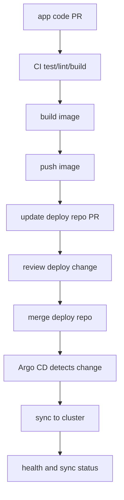

# 01：GitOps 心智模型

## 1. 本节目标

第 6 阶段中，CI 可以直接执行：

```bash
helm upgrade --install ...
```

GitOps 会换一种思路：

```text
CI 不直接部署集群。
CI 只更新 Git 中的期望状态。
Argo CD 在集群内观察 Git，并把集群同步到 Git 中描述的状态。
```

## 2. GitOps 是什么

GitOps 的核心：

```text
Git 是系统期望状态的唯一事实来源。
```

部署不再是“谁 SSH 上去执行命令”，也不再是“CI 拿 kubeconfig 直接改集群”。

而是：

```text
修改 Git
-> 审核 PR
-> 合并
-> Argo CD 同步
-> 集群变成 Git 描述的样子
```

## 3. Push-based CD

第 5、6 阶段属于 push-based CD。

```text
GitHub Actions
-> 持有 kubeconfig/SSH key
-> 直接连接目标环境
-> 执行部署命令
```

优点：

- 直观。
- 容易开始。
- 工具少。

缺点：

- CI 需要部署权限。
- 多环境权限容易复杂。
- 集群实际状态和 Git 可能漂移。
- 审计要跨 CI、集群和脚本拼起来看。

## 4. Pull-based GitOps

Argo CD 属于 pull-based GitOps。

```text
Argo CD 运行在集群中
-> 读取 Git 仓库
-> 渲染 Helm/Kustomize/YAML
-> 比较 Git 期望状态和集群实际状态
-> 同步差异
```

优点：

- CI 不一定需要 kubeconfig。
- Git 记录就是部署记录。
- 集群 drift 能被发现。
- 回滚可以通过 Git revert。
- 环境状态更透明。

## 5. 期望状态和实际状态

期望状态：

```text
Git 仓库里声明的 Kubernetes manifests 或 Helm values。
```

实际状态：

```text
当前集群里真实存在的资源。
```

Argo CD 持续比较两者。

如果不同，就会显示：

```text
OutOfSync
```

如果一致，就会显示：

```text
Synced
```

## 6. Drift 是什么

Drift 是实际状态偏离 Git 期望状态。

例如：

```bash
kubectl scale deployment go-cicd-lab --replicas=5
```

但 Git 中写的是：

```yaml
replicaCount: 2
```

这就是 drift。

Argo CD 可以发现 drift，也可以在开启 selfHeal 后自动修复 drift。

## 7. GitOps 中 CI 的职责

CI 仍然存在，但职责变化：

```text
应用仓库 CI:
  - test/lint/build
  - build image
  - push image
  - update deploy repo image tag

部署仓库 CI:
  - helm lint
  - helm template
  - policy check

Argo CD:
  - sync deploy repo to cluster
```

CI 不再直接改集群。

## 8. GitOps 发布链路



## 9. 初学阶段推荐模式

推荐：

```text
staging:
  main 合并后 CI 自动更新部署仓库 image tag
  Argo CD 自动同步

production:
  release tag 后 CI 创建部署仓库 PR
  人工 review
  merge 后 Argo CD 同步
```

这样既有自动化，也保留生产门禁。

## 10. 小练习

回答：

1. push-based CD 和 pull-based GitOps 的区别是什么？
2. GitOps 中 CI 是否还需要构建镜像？
3. Argo CD 运行在哪里？
4. 什么是 OutOfSync？
5. production 发布为什么适合用部署仓库 PR？

## 11. 本节小结

你现在应该理解：

- GitOps 把 Git 作为期望状态来源。
- Argo CD 负责比较 Git 和集群实际状态。
- CI 不再必须直接持有集群部署权限。
- Drift 是实际状态偏离 Git。
- Git PR 可以成为部署审批和审计入口。

