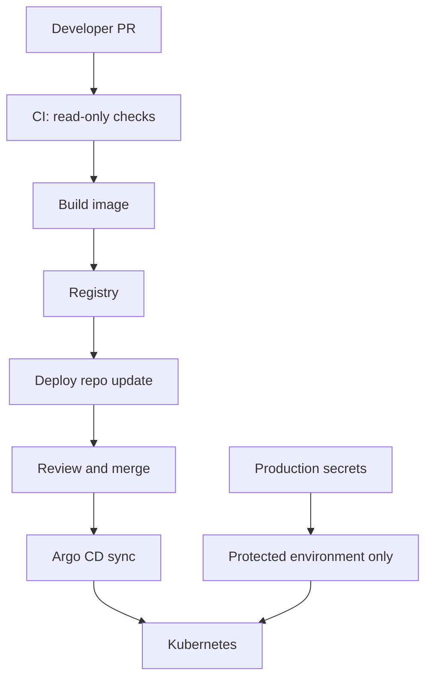

# 01：CI/CD 威胁模型与安全地图

## 1. 本节目标

安全不是“最后加一个扫描工具”。

CI/CD 安全要先回答：

```text
谁能改代码？
谁能改 workflow？
谁能读 secret？
谁能推镜像？
谁能部署生产？
谁能绕过 GitOps？
谁能伪造或替换制品？
```

## 2. CI/CD 关键资产

| 资产 | 风险 |
| --- | --- |
| 源码 | 恶意代码、后门、误提交 secret |
| Workflow | 提权、泄漏 secret、恶意部署 |
| Runner | 执行不可信代码、缓存污染、日志泄漏 |
| Secret | 云账号、数据库、registry、kubeconfig 泄漏 |
| Artifact | 二进制或镜像被篡改 |
| Registry | 镜像被覆盖、tag 被移动、恶意镜像被拉取 |
| 部署仓库 | production values 被篡改 |
| Kubernetes | RBAC 过宽、Secret 泄漏、准入缺失 |
| Argo CD | 越权同步、repo 凭证泄漏、project 过宽 |

## 3. 常见攻击路径

### 路径一：恶意 PR 读取 secret

```text
攻击者提交 PR
-> workflow 在 PR 中运行
-> workflow 使用 production secret
-> 恶意代码打印或外传 secret
```

防护：

- PR workflow 不使用 production secret。
- fork PR 不给敏感权限。
- production 使用 environment approval。

### 路径二：workflow 被改成恶意部署

```text
攻击者修改 .github/workflows/deploy.yml
-> 获得更高权限
-> 部署恶意镜像到 production
```

防护：

- 保护 `.github/workflows/**`。
- CODEOWNERS。
- required reviews。
- job 级最小权限。

### 路径三：第三方 Action 被替换

```text
workflow 使用 action@main
-> 上游 action tag/branch 被篡改
-> CI 执行恶意代码
```

防护：

- 生产 workflow pin 到 commit SHA。
- 限制允许使用的 Actions 来源。
- 定期审查依赖的 Actions。

### 路径四：镜像 tag 被覆盖

```text
production 使用 latest
-> latest 被新镜像覆盖
-> 无法确认生产实际版本
```

防护：

- 使用不可变 tag 或 digest。
- 记录 digest。
- 签名和 attestation。

## 4. 安全优先级

建议按顺序做：

1. secret 不进 Git、日志、镜像。
2. workflow 最小权限。
3. production environment 审批。
4. PR 和 production 权限隔离。
5. 第三方 Actions 固定版本或 SHA。
6. 依赖和镜像扫描。
7. SBOM、签名、provenance。
8. 审计和响应流程。

不要一开始只追求高级签名，却让 production secret 暴露在 PR job 中。

## 5. 安全边界图



## 6. 小练习

为你的项目填表：

| 问题 | 当前答案 | 是否需要加固 |
| --- | --- | --- |
| PR workflow 是否能读 production secret？ | | |
| 谁能改 deploy workflow？ | | |
| 谁能推 production image？ | | |
| production 用 tag 还是 digest？ | | |
| 是否能生成 SBOM？ | | |
| 是否能证明镜像来自 GitHub Actions？ | | |
| secret 泄漏后谁负责轮换？ | | |

## 7. 本节小结

你现在应该理解：

- CI/CD 安全要从威胁模型开始。
- PR、workflow、runner、secret、registry、cluster 都是攻击面。
- 最小权限和环境隔离优先级最高。
- 签名、SBOM、provenance 是供应链安全增强层。

