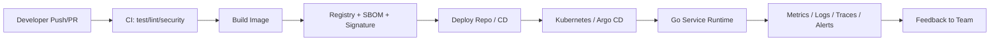

# 01：可观测性地图与关键指标

## 1. 本节目标

前面的阶段已经让你能构建、扫描、发布和回滚。

但真实团队还会问：

```text
PR 反馈为什么这么慢？
失败最多发生在哪一步？
发布后用户是否真的正常？
最近交付效率有没有变好？
CI 成本为什么上涨？
```

这一节先建立 CI/CD 可观测性地图。

## 2. 可观测性不是只看日志

可观测性通常由多类信号组成：

```text
logs：发生了什么。
metrics：趋势和数值是多少。
traces：请求或流程经过了哪些步骤。
events：某个时间点发生了什么变更。
artifacts：可下载的证据和报告。
```

在 CI/CD 中，它们对应：

```text
workflow logs
job duration
test report
coverage report
image scan report
deployment event
Argo CD sync history
Kubernetes event
application metrics
alert history
incident record
```

## 3. CI/CD 的三层反馈

### PR 反馈

回答：

```text
这次代码能不能合并？
测试、lint、安全扫描是否通过？
失败是否容易理解？
开发者多久能拿到结果？
```

关键指标：

- PR CI 总耗时。
- 首次反馈时间。
- CI 成功率。
- 失败最多的 job。
- flaky test 数量。

### 发布反馈

回答：

```text
镜像是否构建并签名？
部署是否成功？
发布后 smoke test 是否通过？
是否能快速回滚？
```

关键指标：

- 部署耗时。
- 发布成功率。
- 回滚次数。
- 变更失败率。
- 部署到恢复的时间。

### 运行时反馈

回答：

```text
发布后服务是否健康？
错误率是否升高？
延迟是否变差？
资源是否耗尽？
```

关键指标：

- 请求量。
- 错误率。
- 延迟。
- CPU/内存。
- Pod 重启。
- 业务成功率。

## 4. CI/CD 可观测性地图



每一段都应该留下证据：

| 链路 | 证据 |
| --- | --- |
| PR | workflow run、test report、lint report |
| 构建 | image digest、build log、SBOM、provenance |
| 发布 | deploy PR、environment approval、Argo CD history |
| 运行 | metrics、logs、traces、alerts |
| 事故 | incident runbook、timeline、action items |

## 5. 第一组核心指标

先不要一口气收集几十个指标。

初学阶段建议从 8 个开始：

```text
CI 总耗时
CI 成功率
失败最多的 job
缓存命中率
镜像构建耗时
部署耗时
发布后 smoke test 成功率
变更失败率
```

这 8 个指标已经能回答多数早期优化问题。

## 6. 指标要能驱动行动

无效指标：

```text
本周 workflow 总运行次数：500
```

它不一定能指导你做什么。

更有效：

```text
PR CI p95 耗时从 8 分钟升到 18 分钟。
其中 Docker build 平均增加 7 分钟。
原因是 buildx cache 没有命中。
下一步检查 cache key 和 Dockerfile 层顺序。
```

好指标的标准：

- 能看趋势。
- 能定位责任链路。
- 能触发行动。
- 能验证优化效果。

## 7. 先建立基线，再优化

优化前先记录：

```text
当前平均耗时
p50/p95 耗时
失败率
最高耗时 job
缓存是否命中
最近 20 次 workflow 的结果
```

不要凭感觉优化。

例如：

```text
感觉 Docker build 慢。
实际数据发现 go test -race 占 70%。
```

方向完全不同。

## 8. 小练习

为你的项目创建：

```text
docs/cicd-observability.md
```

写入：

```markdown
# CI/CD Observability

## Key Questions

- How long does PR CI take?
- Which job fails most often?
- How long does image build take?
- How long does deployment take?
- How do we verify production after release?

## Baseline Metrics

| Metric | Current Value | Target |
| --- | --- | --- |
| PR CI p50 duration | TBD | TBD |
| PR CI p95 duration | TBD | TBD |
| CI success rate | TBD | TBD |
| Image build duration | TBD | TBD |
| Deployment duration | TBD | TBD |
```

## 9. 本节小结

你现在应该理解：

- CI/CD 可观测性覆盖 PR、构建、发布和运行时。
- 日志、指标、事件和 artifact 都是证据。
- 先建立基线，再做优化。
- 指标必须能指导行动，而不是只做展示。

