# 01：毕业项目总览：go-cicd-lab

## 1. 本节目标

毕业项目的目的不是“堆工具”。

它要证明你具备三种能力：

```text
能把 Go 服务工程化。
能设计可靠 CI/CD 流程。
能解释权衡、排障和改进。
```

这一节先定义最终项目长什么样。

## 2. 项目定位

项目名：

```text
go-cicd-lab
```

一句话描述：

```text
一个用于展示 Go 后端 CI/CD 全链路能力的示例服务，覆盖测试、构建、镜像、安全扫描、签名、GitOps 部署、回滚、可观测和流水线优化。
```

它不需要业务功能很复杂。

业务可以很简单：

- Todo API。
- Article API。
- User API。
- Short URL API。

但工程链路要完整。

## 3. 推荐业务功能

以 Todo API 为例：

```text
POST /todos
GET /todos
GET /todos/{id}
PATCH /todos/{id}
DELETE /todos/{id}
GET /healthz
GET /readyz
GET /version
GET /metrics
```

数据库：

```text
PostgreSQL
```

测试：

- handler 单元测试。
- repository 集成测试。
- smoke test。

## 4. 两个仓库模型

应用仓库：

```text
go-cicd-lab
```

负责：

- Go 源码。
- 单元测试和集成测试。
- Dockerfile。
- CI workflow。
- 镜像构建和发布。
- 安全扫描、SBOM、签名。

部署仓库：

```text
go-cicd-lab-deploy
```

负责：

- Helm chart。
- staging/production values。
- Argo CD Application。
- AppProject。
- 部署变更 PR。
- 回滚记录。

为什么分开：

```text
应用仓库关注如何构建可信制品。
部署仓库关注哪个制品部署到哪个环境。
```

## 5. 最终链路

```mermaid
flowchart LR
    A["Developer PR"] --> B["CI: test/lint/govulncheck"]
    B --> C["Merge to main"]
    C --> D["Build Image"]
    D --> E["Scan + SBOM + Provenance + Sign"]
    E --> F["Push Registry"]
    F --> G["Update Deploy Repo"]
    G --> H["Argo CD Sync Staging"]
    H --> I["Smoke Test"]
    I --> J["Production PR"]
    J --> K["Review + Approval"]
    K --> L["Argo CD Sync Production"]
    L --> M["Observe + Rollback if Needed"]
```



## 6. 面试官会看什么

面试官不一定会逐行看你的 YAML。

他们更关心：

- 你是否理解 CI 和 CD 的边界。
- 你是否知道 secret 和权限风险。
- 你是否能解释为什么使用镜像 digest。
- 你是否知道发布失败如何回滚。
- 你是否能定位 CI 变慢或失败。
- 你是否能把工具组合成合理流程。

所以项目要有：

```text
可运行代码
可读文档
可解释设计
可展示记录
```

## 7. 成熟度分级

### 基础版

- Go 服务可运行。
- CI 能跑测试。
- Docker 镜像能构建。
- 能部署到 staging。
- 有 README。

### 标准版

- PR quality gates。
- 镜像推送 registry。
- Helm chart。
- GitOps 部署。
- production PR 发布。
- 回滚演练。

### 进阶版

- govulncheck、Trivy。
- SBOM、provenance、Cosign 签名。
- GitHub environment 审批。
- Argo CD AppProject/RBAC。
- Prometheus metrics。
- 优化报告和 DORA 记录。

第 10 阶段目标是至少达到标准版，尽量接近进阶版。

## 8. 小练习

写一份项目目标：

```markdown
# go-cicd-lab Project Goal

## Business Scope

This project provides a Todo API.

## CI/CD Scope

- PR quality checks
- Container image build
- Security scan
- GitOps deployment
- Release and rollback
- Observability

## Demo Goal

In 15 minutes, I can show how a code change becomes a production deployment.
```

## 9. 本节小结

你现在应该明确：

- 毕业项目不追求业务复杂，而追求工程链路完整。
- 应用仓库和部署仓库各有职责。
- 最终成果要能运行、能展示、能讲清楚。
- 面试关注的是设计思路和排障能力，不只是工具清单。

