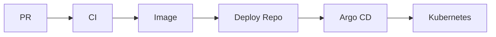

# 08：文档体系与演示脚本

## 1. 本节目标

项目做得好，但讲不清楚，会很吃亏。

这一节帮助你把项目整理成：

```text
别人能读懂的文档
面试能演示的脚本
自己能复盘的材料
```

## 2. 文档分层

建议文档分三层：

### 第一层：README

给第一次打开仓库的人看。

目标：

```text
快速知道项目是什么、怎么运行、展示了哪些 CI/CD 能力。
```

### 第二层：专题文档

放在 `docs/`。

目标：

```text
解释设计细节。
```

### 第三层：演练和报告

发布、回滚、优化、事故演练。

目标：

```text
证明你真的做过，而不是只写概念。
```

## 3. 应用仓库文档清单

```text
README.md
docs/architecture.md
docs/ci-cd.md
docs/security.md
docs/release-checklist.md
docs/security-incident-runbook.md
docs/cicd-observability.md
docs/pipeline-optimization-report.md
docs/final-review.md
```

## 4. 部署仓库文档清单

```text
README.md
docs/gitops.md
docs/release.md
docs/rollback.md
docs/environment-strategy.md
```

## 5. 架构文档模板

`docs/architecture.md`：

````markdown
# Architecture

## Service

## Repository Model

## CI/CD Flow



## Environments

## Security Boundaries

## Observability
````

上面的 Markdown 中嵌套了 Mermaid，真实文件里只保留一层代码围栏。

## 6. CI/CD 文档模板

`docs/ci-cd.md`：

```markdown
# CI/CD Design

## Goals

## Workflows

| Workflow | Trigger | Purpose |
| --- | --- | --- |
| ci.yml | PR/main | test/lint/vuln |
| image.yml | main | build/scan/sign |
| update-deploy-repo.yml | manual/after image | update deploy repo |

## Permissions

## Artifacts

## Release Flow

## Rollback Flow

## Known Gaps
```

## 7. Demo Script：10 到 15 分钟

创建：

```text
portfolio/demo-script.md
```

结构：

```markdown
# Demo Script

## 0:00 - 1:00 Overview

## 1:00 - 3:00 Application Repo

## 3:00 - 5:00 PR CI

## 5:00 - 7:00 Image Build and Security

## 7:00 - 9:00 Deploy Repo and GitOps

## 9:00 - 11:00 Release and Rollback

## 11:00 - 13:00 Observability and Optimization

## 13:00 - 15:00 Summary and Trade-offs
```

## 8. 演示时不要现场冒险

面试或展示时不要依赖现场所有云资源都正常。

准备三套材料：

```text
现场可运行命令
已成功的 workflow run 链接
截图或文档备份
```

如果现场 registry、集群或网络出问题，你仍然能讲清楚。

## 9. 演示命令清单

准备：

```bash
make test
make docker-build
gh run list --limit 5
helm lint ./charts/go-cicd-lab -f ./environments/staging/values.yaml
helm template go-cicd-lab ./charts/go-cicd-lab -f ./environments/staging/values.yaml
argocd app get go-cicd-lab-staging
kubectl rollout status deployment/go-cicd-lab -n go-cicd-lab-staging
curl -fsS "$BASE_URL/healthz"
curl -fsS "$BASE_URL/version"
```

不用每次全部执行，但要知道每条命令证明什么。

## 10. 讲解节奏

推荐表达：

```text
先讲目标。
再讲链路。
再讲关键设计。
最后讲问题和改进。
```

不要从第一个 YAML 文件逐行讲起。

面试官通常更想听：

- 你为什么这么拆 workflow。
- 为什么 production 走 PR。
- secret 怎么保护。
- 回滚怎么做。
- 怎么定位失败。
- 怎么优化耗时。

## 11. 小练习

完成：

1. 建立 `portfolio/demo-script.md`。
2. 写一版 15 分钟演示脚本。
3. 录一次自己讲解。
4. 找出讲不清楚的 3 个地方。
5. 回到文档补充说明。

## 12. 本节小结

文档和演示不是附属品。

它们是你把工程能力传递给别人的桥。

第 10 阶段的目标是：

```text
项目能跑，文档能读，演示能讲。
```
