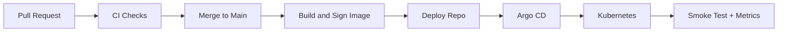

# 09：作品集级 README

## 1. 本节目标

README 是面试官和同事看到项目的第一入口。

一个好的 README 应该让人 3 分钟内知道：

```text
这个项目解决什么问题。
它展示了哪些工程能力。
如何运行。
如何验证 CI/CD。
```

这一节写作品集级 README。

## 2. README 顶部

示例：

```markdown
# go-cicd-lab

`go-cicd-lab` is a Go backend CI/CD capstone project.

It demonstrates how a Go service goes from pull request to production-like deployment with automated testing, container image build, security scanning, GitOps deployment, release verification, rollback, and observability.
```

如果你的 README 用中文也可以。

关键是具体，不要空泛。

## 3. 项目亮点

示例：

```markdown
## Highlights

- Go REST API with health, readiness, version, and metrics endpoints.
- PR quality gates: test, lint, vulnerability check.
- Multi-stage Docker build and non-root runtime image.
- Container image build, scan, SBOM, provenance, and signing.
- GitOps deployment with Helm and Argo CD.
- Staging automation and production PR-based release.
- Release, rollback, and incident runbooks.
- CI/CD observability and pipeline optimization report.
```

亮点要和仓库实际内容一致。

## 4. 架构图

README 中建议放一张 Mermaid 图：



图要帮助理解，不要为了炫技。

## 5. 快速开始

示例：

````markdown
## Quick Start

```bash
git clone https://github.com/your-org/go-cicd-lab.git
cd go-cicd-lab
make test
make build
make docker-build
```
````

注意：如果在 Markdown 教程里嵌套代码块，真实 README 只保留内层代码块。

## 6. 本地运行

````markdown
## Local Development

```bash
docker compose up -d postgres
go run ./cmd/api
```

Health check:

```bash
curl http://localhost:8080/healthz
curl http://localhost:8080/version
```
````

## 7. CI/CD 流程说明

示例：

```markdown
## CI/CD

| Stage | Workflow | Description |
| --- | --- | --- |
| PR checks | `ci.yml` | test, lint, govulncheck |
| Code scanning | `codeql.yml` | static analysis |
| Image | `image.yml` | build, scan, SBOM, sign |
| Deploy | `update-deploy-repo.yml` | update GitOps repo |
```

## 8. 发布与回滚

示例：

```markdown
## Release and Rollback

Staging is updated automatically from trusted main builds.

Production is released through the deploy repository PR:

1. Update production image digest.
2. Verify image signature and provenance.
3. Review values diff.
4. Merge PR.
5. Sync Argo CD application.
6. Run smoke test.

Rollback uses Git revert in the deploy repository.
```

## 9. 证据链接

作品集 README 可以放：

```markdown
## Evidence

- Example PR:
- Successful CI run:
- Image build run:
- Deploy repo PR:
- Rollback drill:
- Optimization report:
```

如果仓库是私有的，至少在文档里说明你保留了这些记录。

## 10. 已知限制

不要假装项目完美。

示例：

```markdown
## Known Limitations

- The production environment is simulated with a Kubernetes namespace.
- The alerting rules are documented but not connected to a real paging system.
- Cloud OIDC examples are documented; the demo uses GHCR and a local cluster.
```

这反而显得诚实和成熟。

## 11. 小练习

为应用仓库写完整 `README.md`。

然后让一个没看过项目的人回答：

1. 这个项目是什么？
2. 怎么运行？
3. CI/CD 流程是什么？
4. 如何发布？
5. 如何回滚？

如果对方答不上来，README 还要改。

## 12. 本节小结

作品集 README 的目标是：

- 快速建立项目可信度。
- 展示工程链路。
- 给面试讲解提供导航。
- 诚实说明已完成和未完成的范围。
