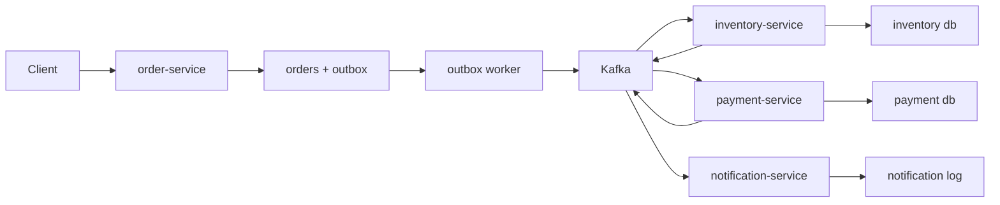

# 01 项目需求与架构

项目名称：电商事件驱动后端。

## 业务目标

实现一个简化链路：

1. 用户创建订单。
2. 订单服务保存订单。
3. 订单服务发布 `order.created`。
4. 库存服务消费订单事件并扣减库存。
5. 支付服务模拟支付成功并发布 `payment.succeeded`。
6. 通知服务消费事件并记录通知日志。

## 服务划分

### order-service

职责：

- 提供创建订单 API。
- 写入订单表。
- 写入 outbox 表。
- 发布 `order.created`。

### inventory-service

职责：

- 消费 `order.created`。
- 幂等扣减库存。
- 发布 `inventory.deducted` 或 `inventory.failed`。

### payment-service

职责：

- 模拟支付。
- 发布 `payment.succeeded` 或 `payment.failed`。

### notification-service

职责：

- 消费订单、库存、支付事件。
- 记录通知日志。
- 模拟发送通知。

### event-worker

职责：

- 扫描 outbox 表。
- 处理 retry topic。
- 处理 DLQ 查询或重放。

## 架构图



## 技术栈

- Go。
- Kafka。
- PostgreSQL 或 MySQL。
- Docker Compose。
- Prometheus metrics。
- structured logging。

## 第一条最小链路

先只实现：

```text
create order -> order.created -> inventory-service 扣库存
```

等这条链路支持幂等、重试、DLQ 后，再扩展支付和通知。

## 本节练习

1. 画出你自己的项目架构图。
2. 写出每个服务的职责。
3. 确定第一条要打通的事件链路。
4. 思考：哪些操作必须在数据库事务中完成？

