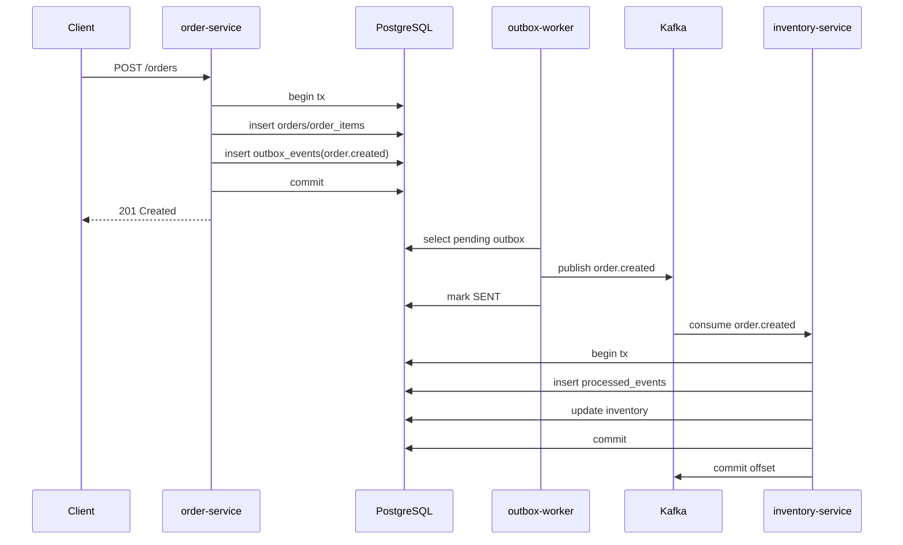

# 6. 综合实践：订单库存可靠消费链路

本节目标：把消息丢失、重复消费、幂等、retry、DLQ、outbox 串成一条订单库存可靠链路设计。

这一节是第 6 阶段的总结实践。完成后，你应该能讲清楚一个真实 Go 后端 Kafka 链路在各种失败场景下如何恢复。

---

## 一、业务链路

```text
order-service
  创建订单
  写 orders
  写 outbox_events

outbox-worker
  扫描 outbox_events
  发布 order.created

inventory-service
  消费 order.created
  幂等扣减库存
  成功后提交 offset
  失败进入 retry 或 DLQ
```

---

## 二、Topic 设计

```text
order.created
order.created.retry.1m
order.created.retry.5m
order.created.dlq
inventory.deducted
inventory.failed
```

message key：

```text
order.created key = order_id
```

---

## 三、数据库表

需要：

```text
orders
order_items
inventory
processed_events
outbox_events
```

关键点：

- `outbox_events.id` 使用 event_id。
- `processed_events.event_id` 唯一。
- 库存扣减和 processed_events 同事务。

---

## 四、创建订单流程

```text
begin tx
insert orders
insert order_items
insert outbox_events(order.created)
commit tx
```

如果事务失败：

```text
订单没有创建，outbox 也没有事件
```

如果事务成功：

```text
订单存在，待发送事件一定存在
```

---

## 五、Outbox Worker 流程

```text
查询 PENDING outbox
发送 Kafka
成功 -> 标记 SENT
失败 -> retry_count + 1, next_retry_at 更新
```

发送成功但标记 SENT 失败：

```text
后续可能重复发送
```

所以库存服务必须幂等。

---

## 六、库存 Consumer 流程

```text
拉取 order.created
解析 JSON
校验字段
begin tx
插入 processed_events
如果已存在 -> commit tx -> commit offset
扣减库存
写库存流水
写 inventory.deducted outbox
commit tx
commit offset
```

---

## 七、库存不足

库存不足不是系统错误，而是业务结果。

可以：

```text
写 inventory.failed 事件
提交 offset
```

不要无限 retry 库存不足。

除非业务设计是等待补货，那就是另一种流程。

---

## 八、数据库超时

数据库超时是可重试错误。

流程：

```text
handler 返回 retryable error
consumer 写 order.created.retry.1m
写 retry 成功
提交原 offset
```

retry consumer 稍后再处理。

---

## 九、JSON 格式错误

JSON 格式错误不可重试。

流程：

```text
解析失败
写 order.created.dlq
写 DLQ 成功
提交原 offset
告警
```

---

## 十、失败场景推演

### 1. Kafka 暂时不可用

outbox worker 发送失败，outbox 保持 PENDING 或 FAILED，后续重试。

### 2. Outbox 重复发送

consumer 通过 processed_events 去重。

### 3. 库存扣减成功但 commit offset 失败

消息重复消费，processed_events 识别已处理，直接返回成功。

### 4. 写 DLQ 失败

不提交原 offset，下次继续处理。

---

## 十一、验收标准

你应该能证明：

- 创建订单后 outbox 有事件。
- outbox worker 能发布 Kafka。
- inventory-service 能消费。
- 重复事件不会重复扣库存。
- 数据库临时错误进入 retry。
- 非法消息进入 DLQ。
- consumer lag 可观察。

---

## 十二、本节练习

1. 画出完整链路图。
2. 写出创建订单事务伪代码。
3. 写出库存消费事务伪代码。
4. 设计 retry 和 DLQ 消息结构。
5. 推演 commit offset 失败后的恢复流程。
6. 推演 outbox 重复发送后的恢复流程。

---

## 十三、本节小结

- 可靠链路需要 outbox、防丢、幂等、retry、DLQ 一起工作。
- Outbox 保证事件最终发布。
- processed_events 保证重复消费安全。
- retry 处理可恢复错误。
- DLQ 保存不可处理消息。
- offset 提交必须在业务成功或消息可靠转移后进行。

---

## 十四、完整链路图



这张图要背后的重点是：

```text
数据库事务负责本地一致性。
Kafka 负责异步传递。
processed_events 负责重复安全。
offset 提交表示 consumer group 的消费进度。
```

---

## 十五、创建订单伪代码

```go
func (s *OrderService) CreateOrder(ctx context.Context, req CreateOrderRequest) error {
    tx, err := s.db.Begin(ctx)
    if err != nil {
        return err
    }
    defer tx.Rollback(ctx)

    orderID := newOrderID()
    eventID := "evt_order_created_" + orderID

    if err := s.repo.InsertOrder(ctx, tx, orderID, req); err != nil {
        return err
    }
    if err := s.repo.InsertOrderItems(ctx, tx, orderID, req.Items); err != nil {
        return err
    }
    if err := s.repo.InsertOutbox(ctx, tx, OutboxEvent{
        ID:            eventID,
        AggregateType: "order",
        AggregateID:   orderID,
        EventType:     "order.created",
        Topic:         "order.created",
        MessageKey:    orderID,
        Payload:       buildOrderCreatedPayload(eventID, orderID, req),
    }); err != nil {
        return err
    }

    return tx.Commit(ctx)
}
```

这里没有 producer。创建订单接口不直接碰 Kafka，这是 Outbox 模式的关键。

---

## 十六、库存消费伪代码

```go
func (s *InventoryService) Handle(ctx context.Context, msg Message) error {
    event, err := DecodeOrderCreated(msg.Value)
    if err != nil {
        return NonRetryable(err)
    }

    tx, err := s.db.Begin(ctx)
    if err != nil {
        return Retryable(err)
    }
    defer tx.Rollback(ctx)

    inserted, err := s.repo.InsertProcessedEvent(ctx, tx, event.EventID, msg)
    if err != nil {
        return Retryable(err)
    }
    if !inserted {
        return tx.Commit(ctx)
    }

    for _, item := range event.Data.Items {
        ok, err := s.repo.DeductInventory(ctx, tx, item.SkuID, item.Quantity)
        if err != nil {
            return Retryable(err)
        }
        if !ok {
            return s.repo.InsertInventoryFailedOutbox(ctx, tx, event, item)
        }
    }

    if err := s.repo.InsertInventoryDeductedOutbox(ctx, tx, event); err != nil {
        return Retryable(err)
    }

    return tx.Commit(ctx)
}
```

handler 返回 `nil` 以后，consumer 框架再提交 offset。

---

## 十七、失败场景表

| 失败点 | 会不会丢 | 如何恢复 |
| --- | --- | --- |
| 创建订单事务失败 | 不会 | orders 和 outbox 一起回滚 |
| Kafka 不可用 | 不会 | outbox 保持 PENDING 后续重试 |
| 发送 Kafka 成功但标记 SENT 失败 | 不丢但可能重复 | consumer 用 processed_events 去重 |
| consumer 处理成功但提交 offset 失败 | 不丢但会重复 | 再次消费时 event_id 冲突 |
| JSON 格式错误 | 不应卡主链路 | 写 DLQ 后提交 offset |
| 数据库超时 | 不应丢 | 写 retry 成功后提交原 offset |
| 写 retry/DLQ 失败 | 不能提交 | 下次继续处理原消息 |

这张表是本阶段最重要的复盘材料。能讲清楚它，说明你真的理解了 Kafka 落地。

---

## 十八、端到端验收步骤

1. 启动基础设施：

```bash
docker compose up -d
```

2. 创建 topic：

```bash
./deployments/topics.sh
```

3. 执行 migration：

```bash
psql "$DATABASE_URL" -f migrations/001_init.sql
```

4. 启动三个服务：

```bash
go run ./cmd/order-service
go run ./cmd/outbox-worker
go run ./cmd/inventory-service
```

5. 创建订单：

```bash
curl -X POST http://localhost:8080/orders \
  -H "Content-Type: application/json" \
  -d '{"user_id":"user_88","items":[{"sku_id":"sku_1","quantity":2,"price":9900}]}'
```

6. 验证库存：

```sql
SELECT sku_id, available
FROM inventory
WHERE sku_id = 'sku_1';
```

7. 验证幂等记录：

```sql
SELECT event_id, handler, processed_at
FROM processed_events
ORDER BY processed_at DESC
LIMIT 5;
```

---

## 十九、如何写到简历里

不要写：

```text
使用 Kafka 实现异步解耦。
```

可以写：

```text
基于 Kafka 设计订单到库存的事件驱动链路，使用 Outbox 保证订单事件不丢失，使用 processed_events 实现 consumer 业务幂等，并通过 retry topic 与 DLQ 处理可恢复错误和坏消息。
```

如果面试官继续追问，就按失败场景表展开。

---

## 二十、扩展练习

1. 增加 `payment.succeeded` topic。
2. 让订单服务消费 `inventory.failed` 后把订单标记为 `INVENTORY_FAILED`。
3. 为 DLQ 写一个重放命令。
4. 为 outbox-worker 增加 `oldest_pending_age` 指标。
5. 故意让 inventory-service 在 commit offset 前崩溃，验证不会重复扣库存。
