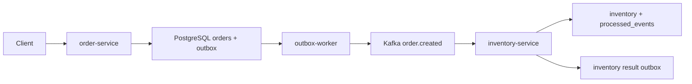

# 10. 综合实践：完成电商事件驱动后端

本节目标：完成整个项目并按验收清单检查。

---

## 一、最终目录

```text
ecommerce-events/
  cmd/
    order-service/
    inventory-service/
    outbox-worker/
  internal/
    kafka/
    order/
    inventory/
    outbox/
  deployments/
  migrations/
  README.md
```

---

## 二、启动顺序

```text
启动 Kafka 和 PostgreSQL
执行 migration
创建 topic
启动 outbox-worker
启动 inventory-service
启动 order-service
调用创建订单接口
```

---

## 三、验收测试

必须通过：

- 正常创建订单。
- outbox 发布事件。
- inventory 消费成功。
- 重复消息不重复扣库存。
- 数据库错误进入 retry。
- 非法消息进入 DLQ。
- consumer 停止时 lag 增长。
- consumer 恢复时 lag 下降。

---

## 四、README 必须包含

- 项目介绍。
- 架构图。
- 快速启动。
- topic 列表。
- 数据库表。
- 可靠性设计。
- 测试方法。
- 常见故障排查。

---

## 五、面试讲解顺序

1. 为什么用 Kafka。
2. 为什么用 outbox。
3. 为什么 consumer 要幂等。
4. retry 和 DLQ 怎么设计。
5. lag 怎么观察。
6. 生产环境怎么规划 topic。

---

## 六、最终小结

这个项目不是为了写复杂业务，而是为了证明你能把 Kafka 放进 Go 后端真实链路：

- 能发布事件。
- 能消费事件。
- 能处理失败。
- 能保证幂等。
- 能观察 lag。
- 能解释生产设计。

---

## 七、完整验收流程

### 1. 启动依赖

```bash
docker compose -f deployments/docker-compose.yml up -d
```

### 2. 执行 migration

```bash
psql "$DATABASE_URL" -f migrations/001_init.sql
```

### 3. 创建 topic

```bash
bash deployments/topics.sh
```

### 4. 启动服务

```bash
go run ./cmd/outbox-worker
go run ./cmd/inventory-service
go run ./cmd/order-service
```

### 5. 创建订单

```bash
curl -X POST http://localhost:8080/orders \
  -H "Content-Type: application/json" \
  -d '{"user_id":"user_88","items":[{"sku_id":"sku_1","quantity":2,"price":9900}]}'
```

---

## 八、数据库验收 SQL

查看订单：

```sql
SELECT * FROM orders ORDER BY created_at DESC;
```

查看 outbox：

```sql
SELECT id, event_type, status, retry_count, sent_at
FROM outbox_events
ORDER BY created_at DESC;
```

查看库存：

```sql
SELECT * FROM inventory;
```

查看幂等记录：

```sql
SELECT * FROM processed_events ORDER BY processed_at DESC;
```

---

## 九、Kafka 验收命令

查看订单事件：

```bash
kafka-console-consumer.sh \
  --bootstrap-server localhost:9092 \
  --topic order.created \
  --from-beginning
```

查看 lag：

```bash
kafka-consumer-groups.sh \
  --bootstrap-server localhost:9092 \
  --describe \
  --group inventory-service
```

查看 DLQ：

```bash
kafka-console-consumer.sh \
  --bootstrap-server localhost:9092 \
  --topic order.created.dlq \
  --from-beginning
```

---

## 十、必须自动化的测试

至少写三个集成测试：

```text
正常链路：创建订单 -> outbox -> Kafka -> 库存扣减
幂等测试：重复 order.created -> 库存只扣一次
DLQ 测试：非法 JSON -> order.created.dlq
```

测试可以先用脚本，后续再写 Go integration test。

---

## 十一、项目 README 模板

README 必须包含：

```text
项目介绍
架构图
启动方式
topic 列表
数据库表
可靠性设计
如何制造 retry
如何制造 DLQ
如何查看 lag
常见问题
```

---

## 十二、最终自评问题

你应该能回答：

1. 为什么创建订单不直接发 Kafka，而是写 outbox？
2. outbox 重复发送怎么办？
3. consumer 为什么要 processed_events？
4. 写 DLQ 失败为什么不能提交 offset？
5. lag 高了如何排查？
6. 生产环境 topic partition 如何估算？

如果这些能讲清楚，这个项目就有面试和作品集价值。

---

## 十三、端到端演示脚本

最终项目最好准备一个可以重复演示的脚本。即使不真的写成 `.sh`，README 里也要按这个顺序给出命令：

```bash
docker compose -f deployments/docker-compose.yml up -d
psql "$DATABASE_URL" -f migrations/001_init.sql
bash deployments/topics.sh
```

启动服务：

```bash
go run ./cmd/outbox-worker
go run ./cmd/inventory-service
go run ./cmd/order-service
```

创建订单：

```bash
curl -s -X POST http://localhost:8080/orders \
  -H "Content-Type: application/json" \
  -d '{"user_id":"user_88","items":[{"sku_id":"sku_1","quantity":2,"price":9900}]}'
```

验收数据库：

```sql
SELECT id, status, total_amount FROM orders ORDER BY created_at DESC LIMIT 1;
SELECT id, status, retry_count FROM outbox_events ORDER BY created_at DESC LIMIT 1;
SELECT sku_id, available FROM inventory WHERE sku_id = 'sku_1';
SELECT event_id, handler FROM processed_events ORDER BY processed_at DESC LIMIT 1;
```

这组命令应该能从“创建订单”一路证明到“库存已扣减”。

---

## 十四、异常演示脚本

面试或复盘时，异常路径比正常路径更能说明水平。

### 1. 演示重复消息不重复扣库存

向 `order.created` 发送同一条事件两次：

```bash
kafka-console-producer.sh \
  --bootstrap-server localhost:9092 \
  --topic order.created \
  --property parse.key=true \
  --property key.separator=:
```

输入两次相同内容：

```text
order_1001:{"event_id":"evt_order_created_order_1001","event_type":"order.created","version":1,"data":{"order_id":"order_1001","user_id":"user_88","items":[{"sku_id":"sku_1","quantity":2}]}}
```

库存只能扣一次。

### 2. 演示 DLQ

```bash
printf 'bad-json\n' | kafka-console-producer.sh \
  --bootstrap-server localhost:9092 \
  --topic order.created
```

查看：

```bash
kafka-console-consumer.sh \
  --bootstrap-server localhost:9092 \
  --topic order.created.dlq \
  --from-beginning \
  --max-messages 1
```

### 3. 演示 Lag

```text
停止 inventory-service。
连续创建多笔订单。
查看 consumer group lag。
重启 inventory-service。
观察 lag 下降。
```

---

## 十五、README 架构图

最终 README 建议放这张图：



图下面要说明：

```text
order-service 不直接调用 inventory-service。
order-service 不直接发送 Kafka。
outbox-worker 负责可靠发布事件。
inventory-service 负责幂等消费。
```

---

## 十六、最终代码检查清单

- [ ] 所有配置来自环境变量。
- [ ] `DATABASE_URL` 不硬编码。
- [ ] producer 发送错误不会被忽略。
- [ ] consumer 关闭自动提交。
- [ ] handler 成功后才提交 offset。
- [ ] retry/DLQ 写成功后才提交原 offset。
- [ ] `processed_events.event_id` 有唯一约束。
- [ ] outbox 查询有索引。
- [ ] 日志包含 `event_id`、`topic`、`partition`、`offset`。
- [ ] README 有启动、验证、排障命令。

---

## 十七、项目复盘写法

项目完成后，可以写一段复盘：

```text
这个项目实现了订单创建后的异步库存扣减链路。
我使用 Outbox 模式解决订单写库和 Kafka 发布之间的一致性问题；
使用 consumer 手动提交 offset 和 processed_events 表保证重复消费不会重复扣库存；
使用 retry topic 和 DLQ 区分可恢复错误与坏消息；
通过 consumer lag、DLQ 数量和 outbox pending age 观察链路健康状态。
```

这段内容可以直接放到作品集或面试自我介绍中。

---

## 二十四、最终演示顺序

向别人演示这个项目时，建议按下面顺序：

```text
1. 展示服务目录结构。
2. 展示数据库表和迁移文件。
3. 启动 Kafka、PostgreSQL 和服务。
4. 创建一笔订单。
5. 查看 outbox 记录。
6. 查看 Kafka 中的订单事件。
7. 查看库存服务消费结果。
8. 模拟重复投递并证明幂等。
9. 模拟失败并查看 retry 或 DLQ。
```

这套演示顺序能把“架构设计”变成可运行证据。
