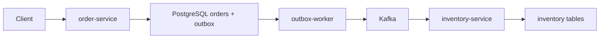

# 1. 需求分析与架构设计

本节目标：明确电商事件驱动后端项目要做什么、拆哪些服务、Kafka 在链路中承担什么职责。

---

## 一、项目目标

实现一条核心链路：

```text
创建订单 -> 发布 order.created -> 库存服务消费 -> 幂等扣减库存
```

扩展链路：

```text
支付成功 -> payment.succeeded
通知服务 -> 消费事件并记录通知
```

---

## 二、服务划分

```text
order-service
inventory-service
outbox-worker
notification-service
```

学习阶段可以先实现前三个。

---

## 三、架构图



---

## 四、核心能力

项目必须体现：

- Outbox。
- Kafka producer。
- Kafka consumer group。
- 手动提交 offset。
- 幂等消费。
- retry topic。
- DLQ。
- lag 观察。

---

## 五、技术栈

```text
Go
Kafka
PostgreSQL
Docker Compose
Prometheus 可选
```

---

## 六、验收

- 创建订单接口可用。
- outbox 有事件。
- worker 能发布 Kafka。
- inventory-service 能消费。
- 重复消息不重复扣库存。
- 错误消息进入 DLQ。

---

## 七、接口需求

### 创建订单

```http
POST /orders
Content-Type: application/json
```

请求：

```json
{
  "user_id": "user_88",
  "items": [
    {
      "sku_id": "sku_1",
      "quantity": 2,
      "price": 9900
    }
  ]
}
```

响应：

```json
{
  "order_id": "order_1001",
  "status": "CREATED"
}
```

---

## 八、核心业务规则

创建订单：

- `user_id` 不能为空。
- `items` 不能为空。
- `quantity` 必须大于 0。
- `price` 必须大于等于 0。
- `total_amount` 由服务端计算。

库存扣减：

- 库存足够才扣减。
- 同一 `event_id` 只能扣减一次。
- 库存不足发布 `inventory.failed`。

---

## 九、服务职责细化

### order-service

负责：

- 提供 HTTP API。
- 校验请求。
- 写 `orders` 和 `order_items`。
- 写 `outbox_events`。

不负责：

- 直接扣库存。
- 直接发送通知。

### outbox-worker

负责：

- 扫描 outbox。
- 发布 Kafka。
- 更新 outbox 状态。
- 失败重试。

### inventory-service

负责：

- 消费 `order.created`。
- 幂等扣库存。
- 发布库存结果事件。

---

## 十、事件流

```text
Client
  -> order-service
  -> PostgreSQL orders/order_items/outbox_events
  -> outbox-worker
  -> Kafka order.created
  -> inventory-service
  -> PostgreSQL inventory/processed_events
```

---

## 十一、失败场景需求

必须处理：

- Kafka 暂时不可用：outbox 保留事件并重试。
- outbox 重复发送：inventory-service 幂等。
- inventory-service 崩溃：重启后从 offset 继续。
- JSON 错误：进入 DLQ。
- 数据库超时：进入 retry。

---

## 十二、本节练习

1. 画出项目架构图。
2. 写出创建订单接口请求和响应。
3. 列出每个服务的职责。
4. 列出必须支持的失败场景。
5. 判断哪些操作必须在数据库事务中。

---

## 十三、第一版项目边界

这一节一定要先把边界写清楚。Kafka 项目最容易犯的错误，是一开始就想把订单、支付、库存、营销、通知全部做完，最后每个地方都只写了一点。

第一版只做一条主链路：

```text
HTTP 创建订单
-> order-service 写订单表
-> order-service 在同一个事务里写 outbox_events
-> outbox-worker 读取 outbox_events 并发布 Kafka
-> inventory-service 消费 order.created
-> inventory-service 幂等扣减库存
```

第一版暂时不做：

- 用户登录和权限。
- 支付网关对接。
- 订单取消。
- 库存回滚。
- 分布式事务框架。
- 前端页面。
- Kubernetes 部署。

这些功能都重要，但不是学习 Kafka 的第一目标。当前目标是把“数据库事务、消息发布、消费幂等、失败重试”这一条链路打通。

---

## 十四、为什么项目里需要 Outbox

创建订单时有两个动作：

```text
1. 写 orders/order_items。
2. 发送 order.created 消息。
```

如果代码写成这样：

```go
err := repo.CreateOrder(ctx, order)
if err != nil {
    return err
}

err = producer.Send(ctx, "order.created", order.ID, payload)
if err != nil {
    return err
}
```

会出现一个真实生产问题：

```text
订单已经写入数据库。
Kafka 发送失败。
库存服务永远不知道这笔订单。
```

反过来也不行：

```text
Kafka 发送成功。
订单写库失败。
库存服务收到一笔数据库里不存在的订单。
```

Outbox 的思路是把“订单数据”和“待发送事件”放进同一个数据库事务：

```text
begin
  insert orders
  insert order_items
  insert outbox_events
commit
```

只要事务提交成功，事件就不会丢；只要事务回滚，事件也不会被发送出去。

---

## 十五、建议的项目目录

为了让后续章节能照着写，建议项目目录先固定下来：

```text
ecommerce-kafka/
  cmd/
    order-service/
      main.go
    outbox-worker/
      main.go
    inventory-service/
      main.go
  internal/
    config/
    db/
    kafka/
    order/
    outbox/
    inventory/
  migrations/
    001_init.sql
  docker-compose.yml
  README.md
```

目录职责：

| 目录 | 职责 |
| --- | --- |
| `cmd/order-service` | 启动 HTTP API |
| `cmd/outbox-worker` | 扫描 outbox 并发送 Kafka |
| `cmd/inventory-service` | 启动 Kafka consumer |
| `internal/kafka` | Producer、Consumer、错误分类、Retry/DLQ |
| `internal/order` | 订单 handler、service、repository |
| `internal/inventory` | 库存 consumer handler、service、repository |
| `migrations` | 数据库建表脚本 |

Go 后端项目里，把 Kafka 封装放在 `internal/kafka`，业务处理放在 `internal/order`、`internal/inventory`，可以避免业务代码到处直接依赖第三方库细节。

---

## 十六、接口验收用例

项目第一版至少要有一个 HTTP 接口：

```http
POST /orders
Content-Type: application/json
```

请求：

```json
{
  "user_id": "user_88",
  "items": [
    {
      "sku_id": "sku_1",
      "quantity": 2,
      "price": 9900
    }
  ]
}
```

成功响应：

```json
{
  "order_id": "order_1001",
  "status": "CREATED"
}
```

验收时不要只看 HTTP 返回成功，还要查数据库：

```sql
SELECT id, user_id, status, total_amount
FROM orders
ORDER BY created_at DESC
LIMIT 1;

SELECT order_id, sku_id, quantity, price
FROM order_items
WHERE order_id = 'order_1001';

SELECT id, event_type, topic, status
FROM outbox_events
WHERE aggregate_id = 'order_1001';
```

预期：

```text
orders 有一行订单。
order_items 有对应明细。
outbox_events 有一条 PENDING 的 order.created 事件。
```

---

## 十七、项目完成标准

本阶段结束时，项目应该能完成下面这组操作：

```bash
docker compose up -d

go run ./cmd/order-service
go run ./cmd/outbox-worker
go run ./cmd/inventory-service

curl -X POST http://localhost:8080/orders \
  -H "Content-Type: application/json" \
  -d '{"user_id":"user_88","items":[{"sku_id":"sku_1","quantity":2,"price":9900}]}'
```

然后验证：

```sql
SELECT available FROM inventory WHERE sku_id = 'sku_1';

SELECT event_id, handler, processed_at
FROM processed_events
ORDER BY processed_at DESC
LIMIT 5;
```

如果初始库存是 `100`，创建一笔数量为 `2` 的订单后，库存应该变成 `98`。

---

## 十八、常见设计错误

### 1. 在 order-service 里直接调用 inventory-service

这样会把异步事件驱动又写回同步 RPC。库存服务一慢，创建订单也会变慢。

### 2. 只依赖 Kafka 的 offset 防重复

offset 只能表示 consumer 读到了哪里，不能证明业务是否已经执行成功。真正的幂等要落在业务库里，例如 `processed_events.event_id`。

### 3. 把 retry 当成无限重试

无限重试会堵住主链路。应该设置最大次数，超过后进入 DLQ，由人工或后台任务处理。

### 4. 事件里只放 order_id

学习项目可以从完整 payload 开始。只放 `order_id` 会让 consumer 再查订单库，增加服务耦合，也会引入跨库读取问题。

---

## 十九、面试表达

面试官问“你为什么在项目里使用 Kafka”，可以这样回答：

```text
我没有把 Kafka 当成简单队列使用，而是把它放在订单和库存之间做异步解耦。
订单服务只负责创建订单和写 outbox，库存服务通过 consumer group 消费 order.created。
为了避免订单写库成功但消息发送失败，我使用 Outbox 模式；为了避免重复消费导致重复扣库存，我用 processed_events 做业务幂等。
失败消息会按错误类型进入 retry topic 或 DLQ，避免阻塞主 topic。
```

这段回答比“Kafka 吞吐高、解耦”更像真实做过项目的人。
