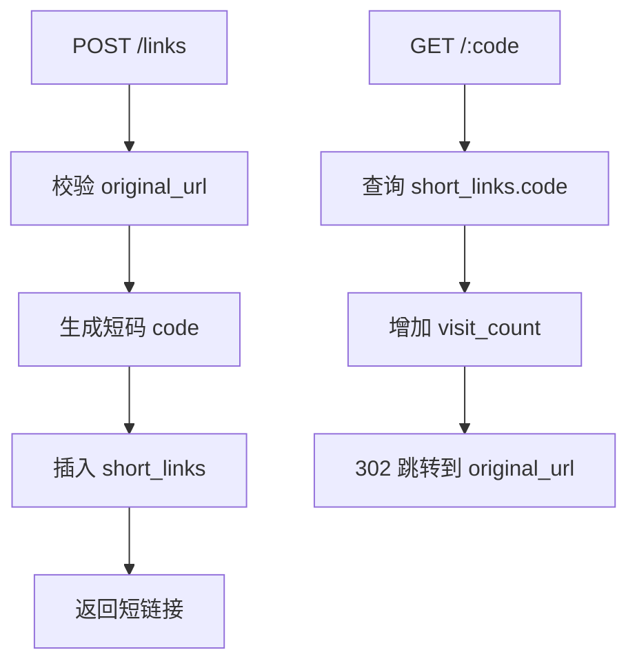

# 1. 需求分析与接口设计

本节目标：在写代码之前，先把短链接服务要做什么、暂时不做什么、接口如何设计说清楚。

真实项目里，很多混乱不是因为代码不会写，而是因为需求边界没有提前定好。

短链接服务也一样。

---

## 一、核心业务流程

短链接服务的主流程是：

```text
客户端提交 original_url
-> 服务端生成 code
-> 服务端保存 code 与 original_url 的映射
-> 返回短链接信息
-> 用户访问 code
-> 服务端找到 original_url
-> 服务端增加访问次数
-> 服务端返回 302 Redirect
```

可以画成：



这个流程里最重要的数据库动作有三个：

```text
INSERT 创建映射。
SELECT 查询映射。
UPDATE 增加访问次数。
```

---

## 二、第一版需求

第一版只做这些功能：

### 1. 创建短链接

用户提交：

```json
{
  "original_url": "https://example.com/articles/postgresql"
}
```

服务返回：

```json
{
  "id": "8b4f5a38-b7b7-4c20-936c-73fbf81c0a17",
  "code": "aB39xQ",
  "original_url": "https://example.com/articles/postgresql",
  "short_url": "http://localhost:8080/aB39xQ",
  "visit_count": 0,
  "created_at": "2026-07-05T10:00:00Z"
}
```

### 2. 根据短码跳转

访问：

```http
GET /aB39xQ
```

服务返回：

```http
HTTP/1.1 302 Found
Location: https://example.com/articles/postgresql
```

同时数据库里 `visit_count` 加 1。

### 3. 查询短链接详情

访问：

```http
GET /links/aB39xQ
```

返回：

```json
{
  "id": "8b4f5a38-b7b7-4c20-936c-73fbf81c0a17",
  "code": "aB39xQ",
  "original_url": "https://example.com/articles/postgresql",
  "visit_count": 12,
  "created_at": "2026-07-05T10:00:00Z",
  "updated_at": "2026-07-05T10:30:00Z"
}
```

### 4. 分页查询短链接列表

访问：

```http
GET /links?limit=20&offset=0
```

返回：

```json
{
  "items": [
    {
      "code": "aB39xQ",
      "original_url": "https://example.com/articles/postgresql",
      "visit_count": 12,
      "created_at": "2026-07-05T10:00:00Z"
    }
  ],
  "limit": 20,
  "offset": 0
}
```

---

## 三、第一版暂时不做什么

暂时不做：

- 用户登录。
- 用户权限。
- 自定义短码。
- 自定义域名。
- 二维码。
- 访问日志。
- 每日统计。
- Redis 缓存。
- 后台管理页面。

这些都可以后续扩展。

先把主流程做稳，比一开始堆功能更重要。

---

## 四、接口列表

建议第一版接口如下：

| 方法 | 路径 | 作用 |
| --- | --- | --- |
| `POST` | `/links` | 创建短链接 |
| `GET` | `/{code}` | 跳转到原始链接 |
| `GET` | `/links/{code}` | 查询短链接详情 |
| `GET` | `/links` | 分页查询短链接列表 |

注意：

```text
GET /{code}
```

这个路由比较宽泛，容易和其他固定路径冲突。

所以路由匹配时要先处理固定路径：

```text
/links
/links/{code}
/{code}
```

也就是说，不要让 `/links` 被误认为短码 `links`。

---

## 五、创建短链接接口设计

请求：

```http
POST /links
Content-Type: application/json
```

请求体：

```json
{
  "original_url": "https://example.com/articles/postgresql"
}
```

成功响应：

```http
HTTP/1.1 201 Created
Content-Type: application/json
```

响应体：

```json
{
  "id": "8b4f5a38-b7b7-4c20-936c-73fbf81c0a17",
  "code": "aB39xQ",
  "original_url": "https://example.com/articles/postgresql",
  "short_url": "http://localhost:8080/aB39xQ",
  "visit_count": 0,
  "created_at": "2026-07-05T10:00:00Z"
}
```

可能错误：

| 状态码 | 场景 |
| --- | --- |
| `400` | JSON 格式错误 |
| `400` | `original_url` 为空 |
| `400` | `original_url` 不是合法 URL |
| `500` | 数据库错误 |

---

## 六、跳转接口设计

请求：

```http
GET /aB39xQ
```

成功响应：

```http
HTTP/1.1 302 Found
Location: https://example.com/articles/postgresql
```

可能错误：

| 状态码 | 场景 |
| --- | --- |
| `404` | 短码不存在 |
| `410` | 短链接已过期，第一版可先不实现 |
| `500` | 数据库错误 |

第一版没有过期时间时，不需要返回 `410`。

但接口设计时可以提前知道：如果以后加 `expires_at`，过期的短链接更适合返回 `410 Gone`。

---

## 七、详情接口设计

请求：

```http
GET /links/aB39xQ
```

成功响应：

```json
{
  "id": "8b4f5a38-b7b7-4c20-936c-73fbf81c0a17",
  "code": "aB39xQ",
  "original_url": "https://example.com/articles/postgresql",
  "visit_count": 12,
  "created_at": "2026-07-05T10:00:00Z",
  "updated_at": "2026-07-05T10:30:00Z"
}
```

可能错误：

| 状态码 | 场景 |
| --- | --- |
| `404` | 短码不存在 |
| `500` | 数据库错误 |

---

## 八、分页列表接口设计

请求：

```http
GET /links?limit=20&offset=0
```

响应：

```json
{
  "items": [],
  "limit": 20,
  "offset": 0
}
```

第一版可以使用 `LIMIT/OFFSET`。

但要记住：

```text
OFFSET 很大时性能会变差。
```

因为数据库仍然要扫描并跳过前面的行。

后续可以升级为基于游标的分页，例如：

```http
GET /links?limit=20&before_created_at=2026-07-05T10:00:00Z
```

---

## 九、URL 校验

创建短链接时必须校验 `original_url`。

最低要求：

- 不能为空。
- 能被 Go 的 `url.ParseRequestURI` 或 `url.Parse` 解析。
- scheme 必须是 `http` 或 `https`。
- host 不能为空。

不要允许这些值：

```text
javascript:alert(1)
ftp://example.com/file.zip
/relative/path
example.com/no-scheme
```

可以允许：

```text
https://example.com
http://localhost:3000/debug
```

生产环境是否允许 localhost，要看业务需求。

---

## 十、接口设计里的安全意识

短链接服务虽然小，但仍然要注意：

### 1. 不要拼接 SQL

错误示例：

```go
sql := "SELECT original_url FROM app.short_links WHERE code = '" + code + "'"
```

正确做法：

```go
row := pool.QueryRow(ctx, `
    SELECT original_url
    FROM app.short_links
    WHERE code = $1
`, code)
```

### 2. 不要把数据库错误原样返回给用户

用户不需要看到：

```text
duplicate key value violates unique constraint short_links_code_key
```

接口可以返回：

```json
{
  "error": "short code conflict, please retry"
}
```

### 3. 不要把任意字符串当作跳转目标

必须检查 URL，避免存入明显危险的 scheme。

---

## 十一、本节达标标准

学完本节后，你应该能够做到：

- 画出短链接服务的核心流程。
- 说明第一版做哪些功能、不做哪些功能。
- 写出 `POST /links`、`GET /{code}`、`GET /links/{code}` 的请求和响应。
- 知道为什么 `/{code}` 路由要放在固定路由之后。
- 知道创建短链接时必须校验 URL。
- 知道接口层不能把数据库错误直接暴露给用户。

