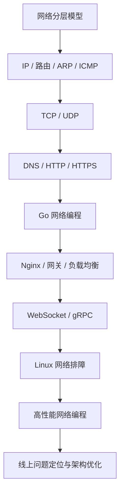

# Go 后端工程师计算机网络学习路线图

> 目标：系统掌握计算机网络核心原理，并能在 Go 后端开发中落地到 Web 服务、RPC、连接池、超时控制、性能优化、线上排障和面试表达。

## 一、学习总览

建议学习周期：8 到 12 周。

学习方式建议：

- 每个知识点都尽量配一个抓包实验、Go 代码实验或 Linux 命令实验。
- 不只记概念，要能解释“为什么这样设计”和“线上出问题怎么查”。
- 学完每一阶段，整理一页自己的笔记：核心概念、常见问题、Go 中的体现、排障命令。

最终能力目标：

- 能清楚解释 TCP/IP、HTTP、DNS、TLS、负载均衡、NAT、网关等核心机制。
- 能写出可靠的 Go 网络程序，理解超时、连接复用、连接池、Keep-Alive、上下文取消。
- 能用 `ping`、`traceroute`、`curl`、`ss`、`tcpdump`、`Wireshark`、`dig`、`lsof` 等工具定位常见网络问题。
- 能理解后端系统中的网络性能瓶颈，如连接数耗尽、TIME_WAIT、队头阻塞、DNS 慢、TLS 握手慢、连接池配置不当。

## 二、阶段 0：准备环境

### 必备工具

- Go 1.22+ 或更新版本
- Linux 环境，推荐 WSL2、Ubuntu 虚拟机或云服务器
- Wireshark
- tcpdump
- curl / httpie
- dig / nslookup
- iproute2：`ip`、`ss`
- netcat：`nc`
- Docker

### 推荐资料

- 《计算机网络：自顶向下方法》
- 《图解 TCP/IP》
- 《TCP/IP 详解 卷 1》
- 《Go 语言高级编程》中网络编程相关章节
- Go 官方文档：`net`、`net/http`、`context`、`crypto/tls`

## 三、阶段 1：网络基础与分层模型

建议时间：1 周。

### 核心知识

- OSI 七层模型与 TCP/IP 四层模型
- 封装与解封装
- MAC 地址、IP 地址、端口号分别解决什么问题
- LAN、WAN、路由器、交换机、网关
- 单播、广播、组播
- MTU 与 MSS

### 必须掌握

- 为什么需要分层
- 数据从浏览器发出到服务器返回的大致路径
- 交换机和路由器的区别
- IP 地址和端口号的区别
- TCP/IP 四层模型中每一层的职责

### 实验任务

1. 使用 `ipconfig` 或 `ip addr` 查看本机 IP、网关、DNS。
2. 使用 `ping` 测试局域网网关和公网地址。
3. 使用 Wireshark 抓一次 `ping` 请求，观察 ICMP 报文。
4. 画出一次 HTTP 请求从客户端到服务端的分层封装过程。

### Go 关联点

- 理解 `net.Dial("tcp", "host:port")` 中的 `tcp`、`host`、`port` 分别对应什么。
- 理解后端服务为什么通常监听 `0.0.0.0:8080` 或 `127.0.0.1:8080`。

## 四、阶段 2：IP、路由、ARP、ICMP

建议时间：1 周。

### 核心知识

- IPv4 地址、子网掩码、CIDR
- 私有地址与公网地址
- 默认网关
- 路由表
- ARP 协议
- ICMP 协议
- NAT 基本原理

### 必须掌握

- `192.168.1.10/24` 的含义
- 同网段通信和跨网段通信的区别
- ARP 如何把 IP 地址解析为 MAC 地址
- `ping` 背后的 ICMP 流程
- NAT 为什么能让多台内网机器共享一个公网 IP

### 实验任务

1. 查看本机路由表：

   ```bash
   ip route
   ```

2. 查看 ARP 缓存：

   ```bash
   arp -a
   ```

3. 使用 `traceroute` 或 Windows 的 `tracert` 观察访问公网服务经过的路由。
4. 用 Wireshark 抓 ARP 请求和响应。
5. 用 Docker 启动两个容器，观察容器之间的 IP 和网络连通性。

### Go 关联点

- 理解服务部署在 Docker、Kubernetes、云服务器时，为什么会遇到容器 IP、宿主机 IP、Service IP、公网 IP。
- 理解服务监听地址、访问地址、转发地址可能不是同一个地址。

## 五、阶段 3：TCP 与 UDP

建议时间：2 周。

这是 Go 后端工程师最重要的网络基础阶段。

### TCP 核心知识

- TCP 面向连接、可靠传输、字节流
- 三次握手
- 四次挥手
- 序列号与确认号
- 重传机制
- 滑动窗口
- 流量控制
- 拥塞控制
- Nagle 算法
- TCP Keepalive
- TIME_WAIT、CLOSE_WAIT
- 半连接队列、全连接队列
- 粘包与拆包

### UDP 核心知识

- 无连接、不保证可靠
- 报文边界
- UDP 适用场景：DNS、QUIC、音视频、游戏同步

### 必须掌握

- 为什么 TCP 建立连接要三次握手
- 为什么 TCP 关闭连接通常是四次挥手
- TIME_WAIT 为什么存在
- CLOSE_WAIT 通常意味着什么问题
- TCP 是字节流协议，不自带消息边界
- TCP 和 UDP 的区别，以及各自适用场景

### 实验任务

1. 用 Go 写一个 TCP Echo Server 和 Client。
2. 用 Go 写一个 UDP Echo Server 和 Client。
3. 使用 `tcpdump` 抓 TCP 三次握手：

   ```bash
   sudo tcpdump -i any tcp port 8080 -nn
   ```

4. 使用 `ss` 查看连接状态：

   ```bash
   ss -antp
   ```

5. 主动制造大量短连接，观察 TIME_WAIT。
6. 写一个 TCP 服务端，故意不关闭连接，观察 CLOSE_WAIT。
7. 设计一个简单协议：4 字节长度头 + JSON body，解决 TCP 粘包拆包问题。

### Go 关联点

- `net.Listener`
- `net.Conn`
- `Accept`
- `Read`
- `Write`
- `SetDeadline`
- `SetReadDeadline`
- `SetWriteDeadline`
- goroutine-per-connection 模型
- TCP 粘包拆包处理

### 小项目

实现一个简易 TCP 聊天室：

- 支持多个客户端连接
- 支持用户加入和退出
- 支持广播消息
- 支持心跳检测
- 支持连接超时关闭

## 六、阶段 4：DNS、HTTP、HTTPS

建议时间：2 周。

### DNS 核心知识

- 域名解析流程
- 递归查询与迭代查询
- A、AAAA、CNAME、MX、TXT 记录
- DNS 缓存
- DNS 污染、DNS 劫持的基本概念
- Go 中的 DNS 解析行为

### HTTP 核心知识

- HTTP 请求行、请求头、请求体
- HTTP 响应状态行、响应头、响应体
- 常见方法：GET、POST、PUT、PATCH、DELETE
- 常见状态码：200、301、302、400、401、403、404、409、429、500、502、503、504
- Header、Cookie、Session
- Cache-Control
- Content-Type
- HTTP Keep-Alive
- HTTP/1.1 队头阻塞
- HTTP/2 多路复用
- HTTP/3 与 QUIC 的基本认识

### HTTPS 与 TLS 核心知识

- 对称加密与非对称加密
- 数字证书
- CA
- TLS 握手
- SNI
- 证书过期、证书链错误

### 必须掌握

- 浏览器访问 `https://example.com` 的完整过程
- HTTP 是无状态协议是什么意思
- Keep-Alive 和 TCP Keepalive 的区别
- HTTP/1.1 和 HTTP/2 的核心差异
- HTTPS 为什么既能加密又能防篡改
- 502、503、504 分别常见于什么场景

### 实验任务

1. 使用 `dig` 查看域名解析：

   ```bash
   dig example.com
   ```

2. 使用 `curl -v` 观察 HTTP 请求和 TLS 握手摘要：

   ```bash
   curl -v https://example.com
   ```

3. 用 Go 写一个 HTTP Server。
4. 用 Go 写一个自定义 HTTP Client，并配置超时。
5. 使用 Wireshark 抓 HTTP 明文请求。
6. 使用自签名证书启动一个 HTTPS 服务。
7. 使用 `GODEBUG=http2debug=2` 观察 HTTP/2 行为。

### Go 关联点

- `net/http`
- `http.Server`
- `http.Client`
- `http.Transport`
- `http.Handler`
- `http.TimeoutHandler`
- `context.Context`
- `crypto/tls`

### Go 后端必须注意的 HTTP Client 配置

```go
client := &http.Client{
    Timeout: 5 * time.Second,
    Transport: &http.Transport{
        MaxIdleConns:        100,
        MaxIdleConnsPerHost: 20,
        IdleConnTimeout:     90 * time.Second,
    },
}
```

重点理解：

- 为什么不能长期使用默认无超时的 `http.Client`
- 为什么应该复用 `http.Client`
- 连接池参数如何影响高并发服务
- 请求取消为什么要用 `context.Context`

### 小项目

实现一个 HTTP 反向代理：

- 转发请求到后端服务
- 保留常见 Header
- 支持超时控制
- 支持简单负载均衡
- 记录请求耗时、状态码、错误信息

## 七、阶段 5：Web 后端网络工程能力

建议时间：1 到 2 周。

### 核心知识

- 正向代理与反向代理
- 负载均衡
- 四层负载均衡与七层负载均衡
- Nginx 基础
- API 网关
- 限流
- 熔断
- 重试
- 幂等性
- 长连接
- WebSocket
- Server-Sent Events
- gRPC

### 必须掌握

- Nginx、网关、后端服务之间的关系
- 负载均衡常见策略：轮询、加权、最少连接、一致性哈希
- 重试为什么可能放大故障
- 超时、重试、熔断应该配合设计
- WebSocket 和 HTTP 的关系
- gRPC 为什么适合服务间通信

### 实验任务

1. 用 Nginx 代理本地 Go HTTP 服务。
2. 启动多个 Go 服务实例，用 Nginx 做负载均衡。
3. 用 Go 写一个 WebSocket 服务。
4. 用 Go 写一个 gRPC 服务和客户端。
5. 模拟后端慢响应，观察客户端超时、Nginx 504。
6. 模拟服务不可用，观察 502 和 503。

### Go 关联点

- Gin / Echo / Chi 等 Web 框架底层仍然基于 `net/http`
- gRPC 基于 HTTP/2
- WebSocket 从 HTTP Upgrade 而来
- 服务治理能力最终都会落到连接、超时、错误处理、流量控制

### 小项目

实现一个迷你 API 网关：

- 路由转发
- 服务发现可以先用静态配置
- 超时控制
- 简单限流
- 请求日志
- 健康检查

## 八、阶段 6：Linux 网络与线上排障

建议时间：1 到 2 周。

### 核心知识

- Socket 文件描述符
- 端口监听
- 连接状态
- 防火墙
- iptables / nftables 基础
- Linux 网络命名空间
- Docker 网络
- Kubernetes 网络基础
- Ephemeral Port 临时端口
- 文件描述符上限
- 连接数上限

### 常用排障命令

```bash
ping example.com
traceroute example.com
curl -v http://localhost:8080
dig example.com
ss -antp
ss -lntp
lsof -i :8080
tcpdump -i any port 8080 -nn
ip addr
ip route
iptables -L -n
ulimit -n
```

### 常见线上问题与排查方向

| 问题 | 可能原因 | 排查方式 |
| --- | --- | --- |
| 请求超时 | 服务慢、网络丢包、DNS 慢、连接池耗尽 | `curl -v`、日志耗时、`tcpdump` |
| Connection refused | 端口未监听、防火墙拒绝 | `ss -lntp`、`lsof -i` |
| No route to host | 路由错误、网络隔离 | `ip route`、`traceroute` |
| 502 | 网关无法连接后端 | Nginx 日志、后端监听状态 |
| 504 | 后端响应超时 | 网关超时配置、后端慢日志 |
| 大量 TIME_WAIT | 短连接过多 | `ss -ant state time-wait` |
| 大量 CLOSE_WAIT | 程序未关闭连接 | `ss -ant state close-wait`、代码审查 |
| too many open files | 文件描述符耗尽 | `ulimit -n`、连接泄漏排查 |
| DNS 慢 | DNS 服务不稳定、缓存缺失 | `dig`、应用解析耗时 |

### Go 关联点

- 连接泄漏：响应体未关闭
- goroutine 泄漏：阻塞在网络读写
- `context` 未传递导致请求无法取消
- `http.Client` 配置不当导致连接池问题
- 服务端缺少 ReadTimeout / WriteTimeout / IdleTimeout

### Go HTTP Server 推荐配置

```go
server := &http.Server{
    Addr:              ":8080",
    Handler:           router,
    ReadHeaderTimeout: 2 * time.Second,
    ReadTimeout:       5 * time.Second,
    WriteTimeout:      10 * time.Second,
    IdleTimeout:       60 * time.Second,
}
```

## 九、阶段 7：高性能网络编程与架构视角

建议时间：持续学习。

### 核心知识

- C10K、C100K 问题
- I/O 多路复用：select、poll、epoll、kqueue、IOCP
- Go netpoller 基本原理
- 零拷贝
- sendfile
- Reactor 模型
- 连接池
- 背压
- 限流
- 流控
- 消息队列中的网络模型

### 必须掌握

- Go 为什么可以用大量 goroutine 处理连接
- goroutine-per-connection 和事件循环模型的区别
- 连接池为什么能提升性能
- 为什么服务端需要背压和限流
- 高并发下网络瓶颈可能出现在 CPU、内存、连接数、带宽、锁、GC、下游服务

### 实验任务

1. 用 `wrk` 或 `hey` 压测 Go HTTP 服务。
2. 调整 `GOMAXPROCS`、连接池、超时配置，观察性能变化。
3. 使用 `pprof` 分析 CPU、内存、goroutine。
4. 使用 `ss` 观察压测期间连接状态变化。
5. 给服务增加限流，并观察过载时的行为。

## 十、推荐学习顺序

### 第 1 周

- 网络分层
- IP、MAC、端口
- 路由、ARP、ICMP
- 完成 ping、traceroute、Wireshark 基础实验

### 第 2 到 3 周

- TCP、UDP
- 三次握手、四次挥手
- 流量控制、拥塞控制
- TIME_WAIT、CLOSE_WAIT
- Go TCP/UDP 编程
- 完成 TCP 聊天室

### 第 4 到 5 周

- DNS、HTTP、HTTPS
- Go HTTP Server 和 Client
- HTTP 超时、连接池、Keep-Alive
- TLS 证书
- 完成 HTTP 反向代理

### 第 6 到 7 周

- Nginx、负载均衡、网关
- WebSocket、gRPC
- 重试、限流、熔断
- 完成迷你 API 网关

### 第 8 到 9 周

- Linux 网络排障
- Docker 网络
- 常见线上网络问题
- tcpdump、ss、lsof、dig、curl 熟练使用

### 第 10 周以后

- 高性能网络编程
- Go netpoller
- pprof
- 压测与性能优化
- 阅读优秀开源项目网络相关代码

## 十一、Go 后端网络学习项目清单

建议至少完成以下 5 个项目：

1. TCP Echo Server
   - 学习 `net.Listener`、`net.Conn`、连接生命周期。

2. TCP 聊天室
   - 学习长连接、心跳、广播、并发安全。

3. HTTP 反向代理
   - 学习 HTTP Header、连接复用、超时、错误处理。

4. 迷你 API 网关
   - 学习路由、负载均衡、限流、健康检查。

5. gRPC 用户服务
   - 学习 HTTP/2、Protobuf、服务间通信、超时和取消。

进阶项目：

1. 实现一个简易 Redis 协议客户端。
2. 实现一个 WebSocket 在线聊天室。
3. 实现一个带连接池的 TCP 客户端库。
4. 实现一个支持限流和熔断的 HTTP 客户端封装。
5. 实现一个简单的服务注册与发现 Demo。

## 十二、面试重点清单

### TCP 高频问题

- TCP 和 UDP 的区别
- 三次握手过程，为什么不是两次或四次
- 四次挥手过程
- TIME_WAIT 的作用
- CLOSE_WAIT 的原因
- TCP 如何保证可靠传输
- TCP 流量控制和拥塞控制的区别
- TCP 粘包是什么，如何解决
- Keep-Alive 是什么

### HTTP 高频问题

- HTTP 和 HTTPS 的区别
- HTTPS 握手过程
- HTTP/1.1、HTTP/2、HTTP/3 的区别
- GET 和 POST 的区别
- 常见状态码含义
- Cookie 和 Session 的区别
- 502、503、504 的区别
- HTTP 长连接是什么

### Go 高频问题

- Go 如何写 TCP Server
- Go 的 `http.Client` 为什么要复用
- `resp.Body.Close()` 为什么必须调用
- 如何设置 HTTP 请求超时
- `context.Context` 在网络请求中的作用
- Go HTTP Server 应该配置哪些 Timeout
- 如何排查 Go 服务连接泄漏
- 如何排查 goroutine 泄漏

### 工程排障问题

- 用户反馈接口很慢，你怎么排查
- 服务偶发 504，你怎么排查
- 大量 TIME_WAIT 怎么分析
- 大量 CLOSE_WAIT 怎么分析
- 服务报 too many open files 怎么办
- DNS 解析慢怎么定位
- 线上接口偶发 connection reset by peer 可能是什么原因

## 十三、每日学习模板

每天建议按这个节奏学习：

1. 学 1 到 2 个核心概念。
2. 画一张流程图或时序图。
3. 做一个命令行实验。
4. 写一个 Go 小例子。
5. 用自己的话写 5 条总结。
6. 准备 2 个面试问答。

示例：

```markdown
## 今日主题：TCP 三次握手

### 核心概念

- SYN
- SYN-ACK
- ACK
- 初始序列号

### 实验

- 使用 tcpdump 抓本地 HTTP 服务的三次握手

### Go 关联

- net.Dial 会触发 TCP 连接建立
- http.Client 首次请求会建立 TCP 连接

### 今日总结

1. TCP 三次握手的本质是双方确认收发能力和初始序列号。
2. 两次握手无法可靠确认客户端接收能力。
3. 服务端 `listen` 后连接先进入半连接队列。
```

## 十四、推荐路线图 Mermaid 图



## 十五、验收标准

学完后，你应该能完成这些任务：

- 手写并解释一个 TCP Echo Server。
- 解释浏览器访问 HTTPS 网站的完整过程。
- 配置一个可靠的 Go HTTP Client。
- 配置一个具备超时保护的 Go HTTP Server。
- 用 Nginx 代理多个 Go 服务实例。
- 用 tcpdump 抓包分析一次 TCP 握手。
- 用 `ss` 判断连接是否存在 TIME_WAIT 或 CLOSE_WAIT 问题。
- 解释 502、503、504 的区别。
- 解释 gRPC 为什么基于 HTTP/2。
- 面对接口超时问题，给出清晰排查路径。

## 十六、学习原则

- 先建立全局地图，再深入细节。
- 先理解常见协议，再理解底层优化。
- 先会写 Go 网络程序，再追 Go runtime 网络模型。
- 每个概念都要问：在后端开发里什么时候会遇到？
- 每个线上问题都要问：我能用什么命令证明它？

网络不是只为了面试，它会直接决定你写出来的后端服务是否稳定、可观测、可排障、可扩展。作为 Go 后端工程师，计算机网络值得反复学三遍：第一遍建立框架，第二遍结合项目，第三遍结合线上问题。
